# Gravewake — The Hollow Tithe

A native Rust gothic arena roguelite: answer the cracked funeral bell, survive Mournhollow, and pay the Collector's tithe in souls. Gravewake has its own name, bell-and-thorn identity, oxblood pack artwork and card backs. It began as a study of the supplied arena/card-shop references; source attribution remains below. Reference images and videos remain in the local working archive but are excluded from the public repository. Geometry, animation, interface interactions, and audio playback are implemented in Rust. The fidelity pass adds painted textures and a generated dealer/table background in `assets/`; these are embedded in the executable.

## Play

Double-click **Play Gravewake.command**, or open **dist/Gravewake.app** after packaging.

Choose **Quit Game** on the title screen. During a run, press **Esc** and choose **Save & Quit Game**; use **Continue Your Descent** next time to resume. **Cmd+Q** and the window close button also save and exit. Quitting weapon practice preserves your existing run.

```sh
./scripts/package-macos.sh
open "dist/Gravewake.app"
```

For development (if Cargo is not on your PATH, use `~/.cargo/bin/cargo`):

```sh
cargo run
cargo test
cargo run -- --smoke
```

The smoke run launches the actual Metal renderer, shoots through a fixed eight-enemy encounter using the normal combat rules, checks the 90-gold reward, buys a pack, uses real egui pointer events to tear it open, reveal the cards, select and equip one, purchases an upgrade, checks serialization, and enters the next round. It saves screenshots to `captures/` and never writes the player's save file.

## The loop

Start with a common Worn Iron pistol. Survive twelve descents through Mournhollow. Each new run draws its own random seed, so spawn positions, Collector draws and pack contents differ between runs; a saved run keeps its seed. Tests, the smoke run and review captures use a fixed seed so they stay reproducible. Between descents, The Collector restores 25 vitality and pays 90–140 gold. Spend it on random weapons, a visible weapon offer, a Hollow Chalice, armor, or Armory Packs. Pack prices increase by 15 gold per purchase and reset at the next shop. Under **Enter descent**, the table previews the next descent (`survival::preview`): its creature count before summons, whether the Tithekeeper opens it ("WAITS" the first time, "RETURNS" after), and the species no earlier descent brought ("NEW: CINDER SKULL, PLAGUE VESSEL"); when none are new it keeps the old line, "SAME FOREST. HIGHER STAKES." The count, boss and pools are the same `descent_quota`, `boss_descent` and `descent_pool` the director spawns from, and `the_descent_preview_matches_what_the_descent_spawns` checks the preview against a real spawn of descents 1 to 17.

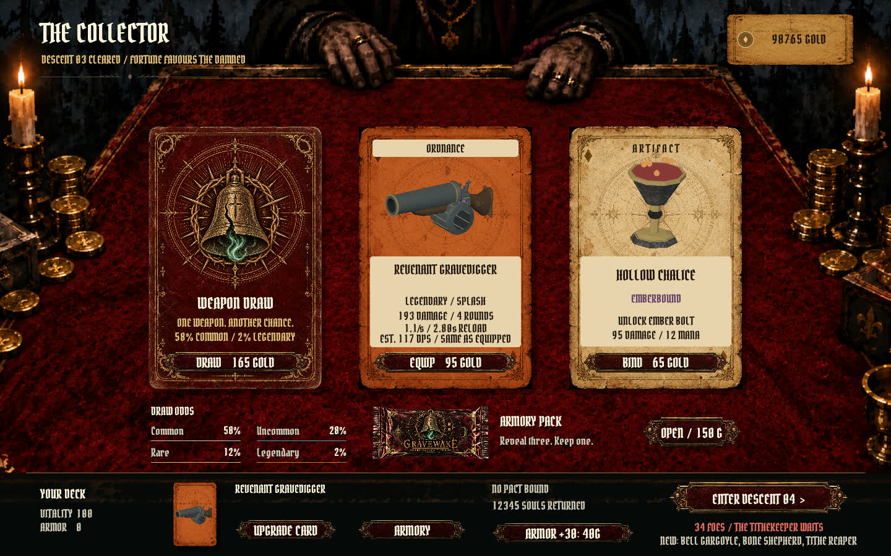

Packs contain three cards. Turn them over individually or reveal all, select one, then take and equip it. Common, uncommon, rare, and legendary cards have different power and treatments. All cards use the standard finish. The armory contains 33 weapons across sidearms, scatterguns, longarms, ordnance, occult implements and melee. See [the complete armory](ARMORY.md) for all 30 additions and their mechanics.

Pack choices and the Collector's offer show an estimated sustained damage per second, counting pellets, burst fire, a full magazine and its reload (melee: damage per swing). The line is inked green when the card beats your equipped weapon and red when it is weaker. Burning and venom weapons add their damage over time on one target over the same cycle (`Card::status_dps`): burn deals 18 per second for 3 seconds after each hit, and venom 12 per second, with each hit adding 1.8 seconds up to 6. The constants live in `src/weapons.rs` and drive both the estimate and the creatures' update, and a test checks that a burning or poisoned creature loses exactly that much. The card's header gives its rarity and family ("RARE / OCCULT"), and the line under its name gives the trait and how many creatures one attack reaches, from the same values combat uses (`WeaponKind::reach` in `src/weapons.rs`): "PIERCES 4" (a shot passes through that many in a line, each taking 18% less than the one before), "CHAINS TO 2 MORE IN 5.0m" (each jump finds the nearest creature within that distance and takes 28% less), "2.4m SPLASH" (every creature whose body is within that distance of the impact), "139° SWEEP" (a melee swing hits every creature in front within its reach and that arc; the Gravebell Hammer's slam adds a splash), joined to the trait word where there is one ("BURN + 2.4m SPLASH", "VENOM + 106° SWEEP"), or "ONE TARGET". Scatterguns' pellets are already counted on the damage line. The estimate is still for one creature, and soul powers aren't included, so a weapon that reaches more is worth more against crowds than the figure says; how many creatures a splash or chain reaches in a real fight isn't known, so the card gives the reach rather than a crowd estimate. `what_a_card_says_about_reach_is_what_combat_does` lines creatures up, in a row, beside an impact and around a swing and checks combat hits exactly what each card says, and `every_cards_trait_line_and_header_fit_a_pack_card` checks every weapon's lines fit a pack card at 1440×900 and 960×600 without going below the 18-point reading size.

Click the equipped card or **Upgrade Card** to open The Binding. Three paths each contain five sequential upgrades: damage, fire/reload speed, and mana regeneration. Completing one path unlocks Soul Siphon, which heals on damage. Upgrades belong to the card and persist across rounds. Switching to a newly drawn weapon equips that new card's upgrades.

Twelve enemy archetypes appear, including Gloamwing dive hunters, six-legged Grave Crawlers, armored Iron Penitents, exploding Plague Vessels, levitating Ash Cantors, Bell Gargoyles, summoning Bone Shepherds, and blinking Tithe Reapers. The Tithekeeper returns on descents 4, 8 and 12 with increasing strength. Enemies have animated head, torso, arm, and leg hit regions. Headshots can detach skulls; severed arms weaken attacks and drop the weapon arm; losing one leg causes a limp and losing both causes a crawl. Deaths create Rapier ragdolls using the surviving body sections.

## Expanded Mournhollow grounds

The arena now spans 96 × 96 metres, about 7.5 times its former nominal playable footprint. Five connected districts provide an open court, ruined chapel, cloister, bell sanctuary and grave orchard. Ten original Blender architecture modules, worn connecting paths, soil and moss shading, smoother wooded banks and 18 braziers replace the close perimeter cage. Major geometry shares collision with player movement, enemy navigation, shots and body physics.

A district label, compass and final-threat bearing help with orientation. Reinforcements stay near the player throughout the larger map, and the final soul drops return promptly. Static geometry is indexed and divided into visibility batches; only the closest six braziers contribute point lights. See [the expansion and native verification](WORLD-REVIEW.md) for captures, traversal checks and reproduction commands.

## Controls

| Input | Action |
| --- | --- |
| W A S D | Move |
| Mouse | Look |
| Left mouse (hold) | Fire (rebindable) |
| R | Reload |
| Shift | Sprint |
| Space | Dodge, with a short invulnerable interval |
| E | Melee |
| Q | Ember Bolt, after binding the Hollow Chalice |
| Escape | Pause / back |
| F11 | Toggle fullscreen (saved) |

Mouse sensitivity, invert look, field of view, sound volume and fullscreen are available in Settings & Controls and persist in `settings.json` beside the run save. **Sprint / Hold** or **Sprint / Toggle** (`toggle_sprint`, older files load as hold) chooses how every sprint binding, keyboard or controller, works: with toggle, a press starts sprinting and the next press stops it, and sprint also ends when you stop moving or leave the arena (`Game::sprint_input`, which `main.rs` calls with whether any sprint binding is held, or was pressed since the last frame). The movement note says "Press" instead of "Hold" to match. F11 and the journal's **Fullscreen** switch both record `fullscreen`, and a normal launch opens borderless fullscreen when it's set (`App::apply_fullscreen`). Scripted runs never load preferences, so they keep their fixed window sizes. F11 calls `App::toggle_fullscreen`, which flips the window and saves at once; the journal's switch sets `fullscreen_changed`, the window follows on the next frame, and the choice is saved when the journal closes.

`scripts/fullscreen-review.sh` checks both while the game runs. It builds the release binary and runs `--fullscreen-review` inside a private virtual KWin (see [Testing in a private compositor](#testing-in-a-private-compositor)) with a throwaway `XDG_DATA_HOME`: from a 1440×900 window in the arena, F11 goes fullscreen, the journal's switch (clicked with egui pointer events) goes back and then fullscreen again, and F11 returns to the window. After each switch it waits for the window, checks that the window and the GPU surface are the output's size (or the original window's), that 20 more frames rendered at that size, and that `settings.json` records the change, then takes a capture in `captures/fullscreen/`. `FULLSCREEN_OUTPUT=3072x1728` sets the virtual output's size. The mode refuses to run outside that compositor or without a throwaway data folder (`fullscreen_review::refusal`), so it can't take over the desktop in use or change a player's settings. The virtual output has a scale factor of 1, so fractional scaling isn't covered. Missing or out-of-range values fall back to defaults or are clamped. Losing window focus pauses combat and releases the pointer.

A player's launch opens the window at `window_size` from `settings.json` (its last windowed size, in logical pixels), or 1440×900 the first time, shrunk if needed, keeping its shape, to 90% of the screen and never below the 960×600 minimum (`game::fit_window`). The screen is the primary monitor, or under Wayland, which doesn't name one, the largest; once the window is on an output, `App::fit_to_screen` shrinks it the same way if that output is smaller. `App::record_window_size` keeps the size from every resize the compositor makes while the window is neither fullscreen nor maximized (nor as large as the screen), and it's saved with the other preferences. A damaged size is forgotten and a tiny one grows to the minimum. Scripted runs keep their fixed sizes and never read or record it.

`scripts/window-review.sh` runs `--window-review` (`src/window_review.rs`) three times in the private KWin with one throwaway data folder: a first launch on a 1366×768 output opens at 1105×691; asked for 1440×900 without fitting, KWin gives 1440×900, bigger than the output, so nothing there would have shrunk a window that asks for too much after it opened (KWin does squeeze a brand-new window to the screen, so on Plasma the old fixed 1440×900 filled a small screen rather than spilling off it; other desktops may not); KWin then resizes the window to 1100×650 through KWin scripting, as dragging its edge would, and the preference follows and is saved on quit. The second launch reopens at 1100×650, and with 3000×1800 written into `settings.json` a launch on a 1920×1080 output opens at 1620×972. The log is `captures/window/review.log`. Window position isn't remembered: Wayland doesn't let a client place its window.

The keys above are defaults. The journal's **Keyboard** page rebinds the ten keyboard actions (`src/controls.rs`), Fire included. Bindings store physical key positions, plus the character each key last produced, so labels match the player's layout after the key has been pressed once. Until then, a default key shows its US label. Every mouse button can be bound too. The left one, which also clicks the journal, is bound by clicking the waiting action's button a second time (`ui::journal_controls`); before Fire could move, that second click cancelled. Fire is on the left button by default and in older files, and whatever is bound to it fires while held in the arena, with a press latched until the next frame (`App::fire_input`); the opening banner and the melee prompt name it. Binding a key that's already in use swaps the two actions; moving Fire to a free key leaves the left button unbound. Escape, F6, F7, F8 and F11 are reserved. Bindings are saved in `settings.json`. A damaged bindings entry resets only the bindings, and the other preferences still load. Every on-screen prompt (the HUD, the opening banner and notices) uses the current labels.

## Save data

The active run is saved atomically to:

```text
~/Library/Application Support/Gravewake/run.json
```

On Linux the folder is `$XDG_DATA_HOME/gravewake/` (normally `~/.local/share/gravewake/`). Linux builds that predate this used the macOS path above under the home directory; those files are imported once, preferring them over any older Dark Veil copies.

On first launch, legacy run, graphics and performance files are copied from `~/Library/Application Support/Dark Veil/` into the Gravewake folder. Originals remain untouched, and existing Gravewake files are never overwritten. If copying fails, loading falls back to the old files.

Pausing, closing the window, finishing a descent, and making purchases save progress. Continue restores position, enemies, health, gold, weapon affixes, upgrades, soul level, collected powers, uncollected orbs, queued level choices, and remaining reinforcements. Body-part damage and missing limbs are saved; older saves load with intact anatomy. Temporary visual particles and rigid-body debris are not serialized.

## Engine

- **wgpu / Metal**: custom forward renderer, procedural mesh batches, 18 braziers with six nearby point lights, moon lighting, distance fog, a mipmapped material atlas, an HDR scene target, fire bloom, contact shadows, and a final vignette composite.
- **winit**: native window, raw mouse input, pointer capture, and focus handling.
- **Rapier 3D**: fixed-step articulated ragdolls with ten bodies, elbow/knee hinges and limited neck/shoulder/hip joints; procedural fracture debris, impact-point impulses, continuous collision detection, friction, sleeping and world collisions. Player locomotion shares the world layout's boundaries, wall and pillar collision shapes.
- **egui**: custom-painted HUD, shop, card treatments, card reveals, upgrade paths, collection, and bestiary. Weapon and chalice previews are rendered offscreen on the GPU using the same textured geometry and materials as gameplay.
- **rodio**: recorded CC0 firearm reports and reload Foley, layered with authored impact, foil, card and ambient sounds. Audio device failure is nonfatal.
- **serde**: versioned JSON save data with atomic replacement.

The lockfile pins the dependency set used for this build. Typography uses **Gravewake Gothic**, a custom adaptation of the title font, throughout headings, menus, cards, descriptions, tooltips and HUD numbers. Its alphabetic letterforms preserve the title design; custom tabular figures and angular punctuation support the interface. Rebuild the standalone TTF with `scripts/build-gravewake-font.py` (requires FontTools). Font credits and SIL Open Font Licenses are in `assets/fonts/` and included in the app bundle. The executable embeds this font, its WGSL shaders, seven art assets and the audio samples; it needs no loose files alongside the app.

## Identity

**Gravewake: The Hollow Tithe** uses a cracked bronze funeral bell, a crown of thorns and a verdigris soul flame. The arena is **Mournhollow**, the merchant is **the Collector**, and the recurring boss is **the Tithekeeper**. The app bundle, Dock icon, launcher, window title, menus, pack wrapper and card backs carry the new identity. The name is a creative choice, not a trademark-clearance claim.

Regenerate the macOS icon from `assets/gravewake-emblem.png` using `./scripts/build-icon.sh`. Packaging installs `assets/Gravewake.icns` in the app. Previous branded art and prompts are archived in `reference/legacy-branding/`; they are not embedded in the executable. Original third-party reference materials and credits keep their historical names.

## Scope and references

The supplied archive contained 17 images and two reference documents, but no original code, mesh assets, or embedded videos. Four video files were subsequently supplied and copied into `reference/videos/`. `reference/INSTRUCTIONS.md` is historical reference material containing quoted prompts; it is not an executable project instruction file.

The reference game is **Dark Veil — The Blackwood**, by Thomas Ricouard (@Dimillian). See `reference/SOURCES.md` for the original post and media URLs. The shop uses an imagegen-cleaned background plate based on the supplied shop screenshot. Its cards, text, models, buttons, pack reveals, and upgrade interactions are rendered separately. The arena is entirely real-time 3D. See `assets/PROMPTS.md` for the generated asset paths and prompts.

This version targets native macOS. Browser/WebGPU deployment, the reference game's full item/affix catalogue, and exact visual or balance parity are future work. Detached limbs and corpses are physical, while living enemies use procedural animation with localized recoil and injury poses. Conventional gunfire uses hit tests; bolts, arrows, grenades and occult orbs travel as simulated projectiles. No video was copied into the game as a substitute for playable content.

## Visual fidelity pass

The revised version replaces the flat shop blockout with a cleaned dealer/velvet/coin/candle background; aged engraved fronts and bell-and-thorn backs; a metallic foil booster wrapper; textured GPU-rendered item previews; hover glints; staggered reveal animations; and a card that lifts from the deck into its upgrade screen. The arena now has irregular layered pine branches, painted bark/stone/earth/bone/metal materials with mip filtering, rounded skulls with sockets and teeth, articulated fingers and toes, tattered cloth, an antlered Warden, hollow gun barrels, and warm fire halos.

`cargo test` covers a full twelve-descent run through the Tithekeeper to victory, card economics, upgrade persistence, shooting, death/victory state separation, and physical debris collision/expiry. `cargo run -- --smoke` writes eight inspectable native-renderer screenshots including the sealed pack and revealed selection.

## Motion and sound pass

The pack uses a 2-second sequence: foil tension, a jagged progressive tear, curling detached strip, foil fragments, staggered card emergence, fan-out and eased landing. Full card surfaces (including text and GPU weapon previews) rotate in perspective through the reveal. Taking a card animates it into the deck. Interaction waits for the relevant movement to finish.

The double barrel now opens on a mechanical hinge, ejects two spent casings, seats two fresh shells one at a time, and snaps closed. The support hand moves between the fore-end and the breech. Pistol and repeater reloads remove and replace their magazines, then rack their actions. Reload durations are weapon-specific and scale with upgrades. Foley cues share the same normalized timeline; ammunition refills only after completion. Recoil has a fast impulse and damped recovery independent of muzzle flash, with view kick, mouse sway, moving fingers/hands, brief multi-part flashes and fading muzzle smoke. Skeletons use lifted swing feet, bent knees, counter-swinging arms, strike follow-through and hit flinch.

Shotgun and handgun reports use actual stereo firearm recordings; see [audio source credits](assets/audio/SOURCES.md). Shell insertion and closing cues also use recorded Foley. Samples are cached before play and vary subtly between shots. Original large audio downloads stay local and are ignored by Git.

To reproduce the 19-second motion review (the normal renderer and UI handlers, with a disposable staged run):

```sh
./scripts/capture-motion.sh
```

The script writes `captures/motion-review.mp4`, including synchronized audio from the same sound bank used by the game. It exercises pack tear, reveals, equip, double-barrel shots/reload, pistol reload and repeater reload, and never modifies the player's save. `cargo test` also checks reload event ordering at 30 and 144 updates/second, ammo timing, and audio bounds/tails. This remains procedural character animation, not the reference's original rigs or motion data.

## Menu polish and expanded armory

Menu buttons now use an engraved burgundy leather and brass plate with preserved decorative end caps, hover lighting, press travel, and serif labels. Settings is a parchment Hunter's Journal with matching sliders; pause, confirmation and bestiary details use the same material treatment. Upgrade nodes are textured gilded medallions, and the vitality HUD uses an engraved frame.

The Armory browser provides six category tabs, animated model cards, rarity previews, descriptions, combat statistics, and a practice action for every weapon. Practice keeps the active run in memory and disables save writes until returning to the catalog. It can be entered from the title or shop. Press Escape to leave practice.

Run `cargo run -- --armory-review` to render the journal, pause, confirmation, six weapon families, and a melee practice interaction through the real native UI. Tests exercise all 33 weapons, trait mechanics, burst/reload behavior, loot coverage, save serialization and practice restoration. The new plate and its built-in imagegen prompt are documented in `assets/PROMPTS.md`.

## Firearm modeling pass

The initial firearm pass added assembled models in `src/guns.rs`: smoothly shaded barrel profiles with recessed bores, rounded receivers, shaped walnut stocks/grips, curved trigger guards, inset side locks, scroll inlay, screws, ejection ports, sight ribs and distinct family silhouettes. The revolver has an exposed six-chamber cylinder; the Gatling has a six-barrel bank and drum; the blunderbuss has a flared bell; the longrifle has a mounted scope; elemental reservoirs have metal cages. Barrel groups, receiver parts and actions retain separate reload transforms. Muzzle effects follow each firearm's actual length.

Steel, brass, walnut and matte leather have separate shader treatments with metal highlights, subtle patina and wood grain. Armory thumbnails fit projected model bounds and use a more revealing three-quarter view. Most weapon silhouettes remain procedural Rust meshes. The weathered arsenal pass below adds Blender-authored replacement assemblies and baked material maps. Blender is an authoring tool only; the game needs no external modeling software.

`cargo run --release -- --gun-review` writes 44 native-renderer captures to `captures/guns/`: all 33 weapon previews, nine first-person views and two reload poses. The mesh test checks finite positions, unit normals and a vertex budget through six reload poses. The normal motion-review capture also exercises firing and reloads with the new assemblies.

## Hollowlight custom shaders

The custom WGSL world and composite shaders now add:

- Depth-reconstructed contact occlusion, height-integrated drifting ground mist, and depth-clipped warm scattering around braziers.
- Damp flagstone highlights and torch reflections on blued steel and brass, cool bone rim lighting, and local muzzle illumination.
- Gentle foliage wind, emissive pulses, and animated ember/frost/venom treatments on affected enemy surfaces.
- Bloom at three scales, conservative edge smoothing, warm/cool color grading and filmic highlight compression. The interface is drawn afterward and stays sharp.

**F6** toggles the treatment. **Settings & Controls → Hollowlight** adjusts intensity from 0 to 100%. The preference is saved separately from the run in `~/Library/Application Support/Gravewake/graphics.json`; 0 uses the previous composite treatment and skips the new depth effects. These are stylized shader effects, not ray-traced reflections or volumetric shadow maps.

`cargo run --release -- --shader-review` captures baseline/full/half intensity, firelight, muzzle lighting, elemental effects, the live settings control and a resized window. It tests the actual slider through egui input and reports frame intervals excluding setup/capture frames. On the development M4 Max, the 1440×900 release review remained near the 60 Hz presentation cap with both the original and Hollowlight treatments (roughly 16.7 ms/frame); this is an observed scene result, not a GPU-only timing or a guarantee for every machine. The review uses a disposable run and never writes user saves or preferences.

## Location-based damage and body physics

`src/anatomy.rs` shares the animated skeletal pose between hit detection and rendering, including Warden scale, floating Cinder Skulls, attack swings, recoil, and the injured stance. Bullets use nearest capsule intersections; projectiles sweep their traveled segment to avoid tunneling. Missing parts have no hit volume. Head hits deal double health damage, limb hits deal 80%, and structural damage accumulates independently. Limb thresholds scale with enemy health and cap at 120 damage. Ordinary enemies die on decapitation; the Warden can continue headless.

A surviving enemy switches to the remaining arm after disarm. One or two lost arms reduce attack damage to 55% or 20% and slow attack cadence. One lost leg reduces movement to 48%; two reduce it to 20%, with an eased collapse, planted crawling hands, and a raised neck. Melee swings choose a body region from their aim; explosive direct impacts retain the hit region and splash reaches the nearest surviving body surface.

Sever events preserve the exact animated pose at impact: skull sockets/teeth, antlers, fingers, toes, and the Skirmisher's sword carry into physics without a preset death pose. A complete humanoid has ten physical sections and nine joints, including separate upper/lower arms and legs. Knees and elbows hinge within anatomical limits; neck, shoulders and hips have limited rotation. Detached arms and legs keep their elbow/knee joints. Missing limbs stay missing, and capped bone/marrow surfaces cover the wounds on both sides of a sever.

Heavy shotgun, ordnance, hand-cannon, slug and heavy-melee impacts can fracture skull or torso geometry along procedurally chosen planes, producing two to four capped mesh fragments. Ordinary limb detachment follows the authored anatomical sections. Subsequent shots, melee strikes and explosions kick or tumble existing remains, with walls blocking these impulses; they do not award additional kills or experience. Head-only creatures use their own shaped collider. The fixed-step solver supports continuous collision detection and sleeping. The pool is capped at 144 physical sections, evicts complete old groups, and expires remains after 18 seconds. Each section's vertices are uploaded to the GPU once and drawn with a per-frame transform (see [PERFORMANCE.md](PERFORMANCE.md)); set `GRAVEWAKE_CPU_CORPSES=1` to expand them on the CPU instead, for comparison.

Rapier is built with its `enhanced-determinism` feature, so body physics repeats exactly from run to run. Without it, Parry's internal hash maps use a hasher seeded randomly for each process, so contact pairs were solved in a different order each run, and the anatomy review's fracture scenes ended differently every time. With the feature, three runs of the anatomy review produced identical captures (all 720 frames) and identical logs, and the CPU and GPU corpse paths stay within a normalised RMSE of 0.0006 of each other for the whole review. The feature also uses `libm` for the solver's maths, so results don't depend on the platform's maths library. Simulation time in the corpse benchmark was unchanged within noise (2.08–2.18 ms with the feature, 2.09–2.11 ms without, at load 20–29).

```sh
./scripts/capture-anatomy.sh
```

This records a 24-second native Metal review using real weapon fire: decapitation, articulated disarm, limp/crawl, a complete ten-body collapse, heavy mesh fracture, and a second explosion moving existing debris. It writes `captures/anatomy-review.mp4` with synchronized game audio and a diagnostic manifest, and never writes player saves or settings. Assertions verify pose handoff, independent joint motion, missing-part persistence, finite motion and the body budget. Unit tests also cover rotated/scaled hit regions, cover, fast projectiles, injury consequences, save compatibility, capped fracture geometry, settling and expiry. See `RAGDOLL-REVIEW.md` for this pass's verification.

The supplied `reference/videos/ragdoll.mp4` informed this pass. The linked browser reference at https://dark-veil.dimillian.chatgpt.site/ loaded into its arena, but its pointer-capture control was blocked in the in-app browser, so combat comparison used the supplied footage.

## Weathered arsenal and Blender assets

All 33 weapons use an aged material palette: pitted iron with localized brown corrosion, oxidized brass, worn walnut, and oil-darkened leather. Four 512-pixel Blender material bakes form an albedo atlas and a linear roughness/height/metalness atlas. The shader uses those maps for muted highlights and surface pitting, including in armory previews. UVs are attached to the model rather than the camera, so aiming and reloads do not move the texture across its surface. Environmental materials retain their existing treatment.

Bone and arsenal shading now use a darker, muted palette to match the arena. Worn metal has softer highlights driven by moonlight and nearby flames, reduced camera fill, and less albedo amplification; the armory retains its separate inspection lighting. Skeletons use weathered ash-ivory with a restrained silhouette rim. Ragdolls retain their authored colors instead of being recolored pale on death. Matched native captures are saved in `captures/material-tone/before` and `captures/material-tone/after`.

Seven weapons now have Blender-authored assemblies: Iron pistol, Double shotgun, Butcher Cleaver, Grave Revolver, Slugbreaker, Repeater, and Longrifle. They use shaped receivers and stocks, smoothly shaded barrels, fitted locks, dark open bores and distinct moving actions. The revolver cylinder, shotgun hinge, pump, magazines, and repeater lever preserve their mechanical groups. The other 26 designs retain their existing geometry and receive the revised shared textured finish. Rarity remains visible in small inset jewels.

Editable source: `assets/blender/weathered-armory.blend`. Rebuild with `./scripts/build-weathered-armory.sh`; source/material details are in `assets/weapons/SOURCES.md`. The exported meshes and texture maps are embedded in the app. Asset tests check finite geometry and UVs, mechanical groups, stable reload UVs, and weathered material coverage for every weapon.

## Souls and survival

Every defeated enemy drops a green soul orb; stronger enemies are worth more experience and bosses drop a gold orb worth 60. Drops bob above the ground, persist until collected, and accelerate toward you within pickup range. On a cleared wave, the remaining souls sweep toward you before the shop opens, so no experience is lost. The HUD shows soul level, experience, active powers, live enemies, and approaching reinforcements.

Leveling freezes combat and offers three distinct engraved power folios. Click one or press **1 / 2 / 3**. Ten powers each have five ranks: weapon damage, attack recovery, pickup radius, maximum health, healing on pickup, automatic lightning, orbiting blades, frost pulses, retaliatory thorns, and movement speed. Multiple earned levels queue separate choices. Fully ranked powers leave the pool; after all fifty ranks, further levels restore health and grant armor. These powers persist for the run, independently of weapon-card upgrades.

Reinforcements arrive in batches, with new enemy types introduced over the opening four descents. Each descent draws from its pool through a seeded shuffle bag: every pass brings each species once in a random order, so a wave keeps the same mix of creatures as before, but the order and pairings change from run to run. Tithekeeper descents still open with the boss. Waves contain 19–74 enemies before summons; no more than 48 living enemies can crowd the arena. Ranged attacks travel as dodgeable projectiles. Dives, blasts, summons and blinks have visible warnings. Ground creatures and low flyers separate and navigate shared obstacle footprints; the higher aerial poses retain their flight animation. After descent twelve, **The Tithe Never Ends** continues the build with stronger waves (reinforcement quota capped at 180).

`cargo test` covers all twelve species, twelve-descent combat progression, soul drops without duplication, collection and final-wave vacuum, saved/queued choices, caps and legacy defaults, automatic powers, ranged warnings, summon bounds, and existing weapons/anatomy/physics. `./scripts/capture-survival.sh` produces `captures/survival-review.mp4` from the native Metal renderer, visits all twelve bestiary entries, renders a 48-enemy stress scene, then records combat, soul collection and power choices through real UI handlers. The capture uses a disposable fourth-descent showcase with three initial automatic powers and never writes the player's save.

## Performance

The renderer now instances repeated enemy shapes on the GPU, caches primitive geometry, reuses frame buffers, and skips offscreen rendering while preserving gameplay simulation. Unlocked presentation is the default. **F7** toggles VSync; **F8** shows the FPS counter. Both are also in Settings & Controls and are saved between launches. Minimized/occluded windows suspend continuous rendering.

**Frame limit** in Settings & Controls (`frame_limit` in `settings.json`: 0 for Off, or 30, 60, 90, 120, 144, 165 or 240; older files load as Off, other values snap to the nearest) caps the frame rate with VSync on or off, and while the window is visible but not focused the game draws at most 30 frames per second (`pacing::effective_limit`). Minimized or hidden windows still stop drawing. `pacing::Pacer` sleeps the event loop until each deadline (`ControlFlow::WaitUntil`) instead of spinning, and schedules each deadline from the previous one, so a late wake-up is made up on the next frame; a frame longer than a whole period starts a fresh schedule rather than a burst. The slider steps one listed rate per D-pad press (`gamepad::Target::step`). Scripted runs ignore the limit.

`--pacing-review` measures it on the title screen: five seconds each with no limit, 30, 60 and 144, and in the background (the unfocused flag set directly, since nothing in a scripted run can take focus from the window), reporting frames per second, mean, 95th-percentile and longest frame times and the process's CPU time to `captures/pacing/report.json`. It fails if a limited stage draws more than 2% above its limit, or more than 2% below it when 95% of the unlimited title's frames took under 90% of the limit's period (a limit can't make slow frames faster, so on a busy machine a high limit is checked only as a cap). Run it in the private compositor:

```sh
XDG_DATA_HOME=$PWD/captures/home scripts/nested-kwin.sh -- target/release/gravewake --pacing-review
```

Run `./scripts/benchmark.sh` for a repeatable native benchmark. See [performance results and methodology](PERFORMANCE.md) for measured frame times, matched reference images, and limitations.

## Controllers

`src/gamepad.rs` polls controllers through gilrs (evdev/udev on Linux, IOKit on macOS) and maps them in pure functions that tests can drive without hardware. In the arena, sticks have radial deadzones, and the look stick uses a squared response. Its turn rate follows the Controller page's **Stick look speed** (50–200% of 3.4 radians per second at full deflection, `Preferences::stick_speed`, `gamepad::look_turn`) and the invert-look setting; before round 7 it followed the mouse's Aim sensitivity, and 100% matches that rate at the default sensitivity. **Aim assist** (on by default, `aim_assist` in `settings.json`; older files load with it on) scales the stick's turn by `Game::aim_assist`: 1 normally, down to 0.5 while the aim line passes within 0.6 m (at the creature's scale) of a living creature's head or chest, rising back to 1 at 1.2 m, for creatures within 40 m that aren't behind a wall or monument (`world_layout::obstruction`). It only slows the turn; it never moves the view by itself, it's skipped when the stick is centred, and the mouse path never calls it. Menus use a virtual cursor that sends ordinary egui pointer events, so every screen (shop, packs, the Binding, Armory, journal) works without a separate navigation layer; moving the mouse hands control back to it. The D-pad jumps the cursor between controls: every button, upgrade medallion, slider and the equipped card reports its rectangle each frame (`ui::pad_targets`, `gamepad::Target`), and a press moves to the nearest control within about 50° of that direction, weighing sideways distance double, or failing that the nearest on that side (`gamepad::neighbour`). The first press lands on the control nearest the centre of the screen. While the controller cursor shows, a brass frame with ivory corners marks the control under it (`gamepad::focused`: the smallest target containing the cursor, so a card's button wins over the card), drawn above menus and dialogs; between controls only the ring shows. A held direction repeats after 0.4 s, then every 0.12 s. On a slider the cursor rests on the knob, so A there keeps the value; left and right move it a twentieth of its range by clicking there, and up and down leave it. The journal and the new-run dialog clear the list when they open, so the controls behind them can't be reached. The level-up screen keeps the D-pad for choosing powers, and screens without controls fall back to nudging the cursor. The most recently used controller drives the game, connections and disconnections show a notice, and if the controller you're fighting with disconnects (the last input came from it), the game pauses as it does when the window loses focus (`Game::controller_lost`). A missing or inaccessible device leaves keyboard and mouse play unchanged. Linux builds need `libudev`.

The journal's **Controller** page remaps buttons (`gamepad::PadBindings`). Fire, Sprint, Dodge, Reload, Melee and Ember Bolt each have a main and a second slot; the defaults are RT; LT and left-stick click; A; X; B and RB; Y and LB. A, B, X, Y, LB, RB, LT, RT and both stick clicks can be bound. The triggers count as buttons once pulled past the 0.35 threshold (`Pad::poll` turns the analog values into presses and releases). Start (pause), the D-pad (powers and cursor nudges) and the sticks (movement, look and the menu cursor) are reserved, and in menus A always selects and B always goes back, whatever they're bound to in the arena. Binding a button that another slot holds swaps the two slots; an emptied main slot takes its action's second button; a change that would leave an action with no button is refused with a note ("B is Dodge's only button."). Choosing a slot waits for the next controller press, which binds it. The cursor neither moves nor clicks while it waits, Start or Escape cancels, and so does a click elsewhere. The press that chose the slot can't bind it, because egui registers the click when A is released. **Restore default buttons** resets them. Bindings are saved as `pad_bindings` in `settings.json`. A damaged entry (an unknown action, a reserved or duplicated button, or an action with no buttons) restores the default buttons and keeps the other preferences. Prompts name each action's main button.

Prompts follow the last input device (`controls::Device`). A controller button press, a trigger past its threshold or a stick past its deadzone switches the HUD hints, the opening reminder, the field notes, the chalice and practice notices and the level-up line to controller names (`Game::prompt`, which a unit test checks against the arena mapping with default and remapped buttons). A key press, a mouse click, captured mouse motion, or desktop pointer motion of more than 4 pixels switches back. The choice isn't saved.

`cargo run --release -- --smoke --gamepad` runs the normal smoke test but opens the pack with the controller: the stick steers the cursor to TEAR OPEN, then D-pad presses jump it to REVEAL ALL, the middle card's CHOOSE CARD and TAKE & EQUIP, and A presses each. The run fails if a D-pad press leaves the cursor anywhere but the intended control. The `pad-collector-dpad` and `pad-journal-slider` text-review fixtures show the cursor after D-pad presses in the Collector and on a journal slider. No physical controller has been tested yet.

## Records

`records.json`, beside the run save, keeps lifetime bests: runs started, deepest descent entered (endless descents count), most souls in one run, victories and the fastest victory. After the first run, the title shows them under the menu, and the ending screen lists any record the run set. Practice and diagnostic modes never change records.

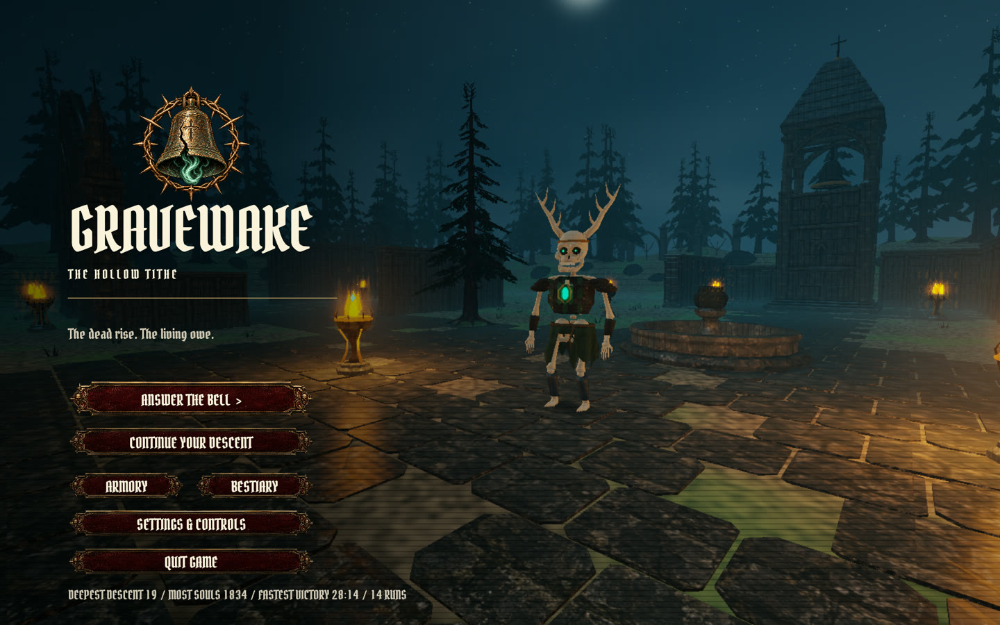

`records.json` also keeps the chronicle (`history`, `Records::chronicle`): the last ten runs, newest first, each with its run number, the descent reached, how it ended (slain, with the killing blow when one was recorded; the debt paid; or abandoned), whether it went on into endless survival, souls, time, soul level and the weapon held. A death or victory adds its entry as it happens. A run that goes on into endless survival replaces its own victory when it ends, so each run has one entry. Starting a new run over a saved one that hadn't ended (anything but the death or victory screen) enters the saved run as abandoned. Older files load with an empty chronicle; practice and scripted runs never add to it, since practice is skipped and scripted runs never write `records.json`. The title shows the latest five beside the scene once there's one (`chronicle` in `src/ui.rs`): the ending and the descent ("ENDLESS 19" past the twelfth), then time, souls, level and weapon, dropping the level and then the weapon when the line wouldn't fit. `the_chronicle_fits_beside_the_title_menu` draws the title with the longest blow and weapon names there are, in 1440×900, 960×600 and 1920×1080 windows, and checks that the panel stays on screen, clear of every title button, the logo and the records line, and that each line stays inside it and clear of its descent.

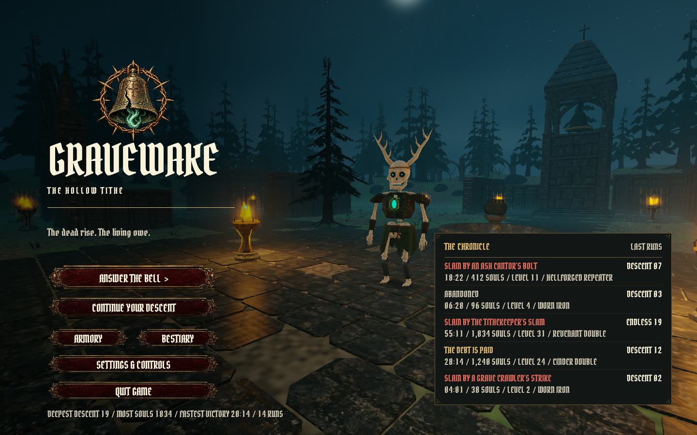

## Pause ledger

The pause menu has two panels beside it (`pause_ledger` in `src/ui.rs`). **The run so far** lists the descent, run time, vitality and armor, souls, headshots, damage dealt and taken, gold and soul level, then the equipped weapon: name, rarity and trait, damage, the card estimate and its Binding ranks (damage / speed / mana, plus Soul Siphon). **Bound powers** lists each power held with its rank and what it does at that rank ("+75% weapon damage", "67 damage to 5 foes within 14 m every 1.7 s"). The numbers come from `survival::power`, which the powers themselves use, so the text can't drift from the game. In practice only the weapon shows. The HUD is hidden behind the pause screen, and the panels hide while the journal is open over it. `the_pause_ledger_fits_beside_the_menu` checks in a real egui frame that both panels clear the menu, stay on screen and hold their text with every power at full rank, in 1440×900, 960×600 and 1920×1080 windows.

## Death recap and run summary

Each hit on the player records its source: the species and the attack (strike, bolt, slam or burst; projectiles remember the caster's species). Hits that land in the same update share the vitality lost, in proportion to their raw damage, and the heaviest of them becomes the latest blow. Armor-absorbed damage doesn't count as damage taken, and neither does overkill. The ending screen shows the killing blow ("SLAIN BY THE TITHEKEEPER'S SLAM"), the species that took the most vitality over the run and its share, and a summary grid: descent, souls, headshots, time, damage dealt (health removed by weapons, spells and powers, without overkill), damage taken, soul level and power ranks, plus the equipped weapon.

The statistics live in `run.json` (`stats`); older saves load with zeros. Practice works on a copy of the run, so it never changes them.

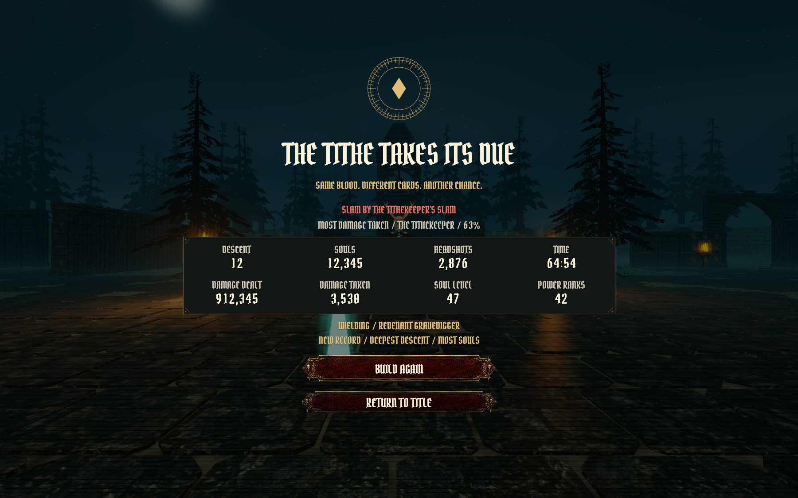

## Adaptive music

`src/music.rs` renders a 32-second loop in D minor (Dm, B♭, Gm, A at 60 BPM) in three synchronized stereo layers: **calm** (organ and choir pads, a low pedal and a distant bell), **pressure** (a heartbeat drum and a bowed eighth-note ostinato) and **boss** (a root-and-tritone drone, a semitone choir cluster and war drums). Everything is synthesized at start-up on a background thread (about 1.1–1.5 s on the Linux test machine), so the window isn't delayed; the music fades in once it's ready. The tail of each layer is folded back onto its start, so pads, the bell and echoes carry across the loop seam without a click.

One rodio source plays all three layers from the same position and crossfades their gains with a 2.5-second time constant, so the layers never drift apart. The title, the Collector, the Binding, the Armory and victory are calm. In the arena, the pressure layer follows the number of living enemies (full at 16) and low vitality (rising below 50%), and the boss layer plays while the Tithekeeper is alive. **Music volume** in Settings & Controls is saved in `settings.json` and is scaled by Sound volume. Smoke and review runs keep the music silent.

`--export-audio` also writes `captures/audio/music-{calm,pressure,boss}.wav` and a 64-second `music-adaptive-mix.wav` that moves from calm through a rising crowd to the boss. This is an original, sparse synthesized score, not recorded music. It was checked with spectrograms and level measurements only, not by ear.

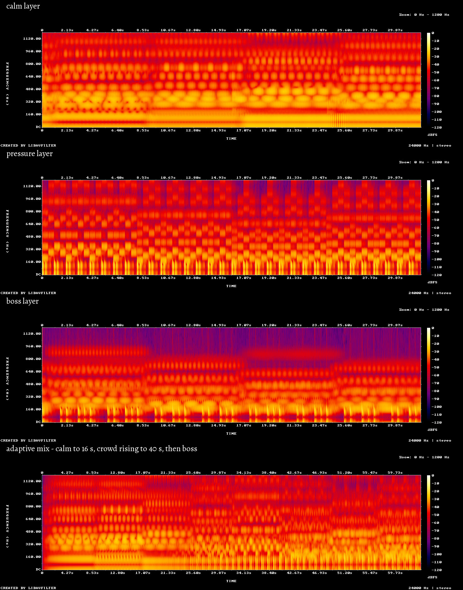

## HUD size

**HUD size** in Settings & Controls cycles 80, 90, 100, 110, 120 and 130% (`Preferences::hud_scale`, saved in `settings.json`; older files load at 100%, and other values are clamped). Each HUD group scales around its own anchor through `Canvas::anchored`: the status panel from the top-left corner, the descent panel, compass, last-threat bearing and boss bar from the top centre, gold from the top right, vitality, armor and the chalice from the bottom left, the weapon panel from the bottom right, and the dodge readout, field notes and notices from the bottom centre. The reticle, hit marks, damage arcs and off-screen warnings keep their size. Menus, cards and the journal are unchanged. Below 100% the 13.5-point text floor shrinks with the HUD, so labels stay inside their panels; at 80% in a 960×600 window, HUD text is about 11 points.

At 100% the vitality group, dodge readout and weapon panel use all but about 225 of the 1440 design units, and the boss bar ends about 35 units above the damage arcs, so up to 110% the layout only moves the dodge readout right if a larger HUD crowds it. Above 110% (`Preferences::COMPACT_ABOVE`) a compact layout takes over:

- armor moves into the vitality plate, opposite the vitality figure, and the chalice bar narrows to the plate;
- the dodge readout narrows from 238 to 200 units;
- the descent panel and compass narrow from 454 to 420 units, so they clear the status panel at 130%;
- the Tithekeeper's name and health join the descent panel (beside the hunting count) instead of a separate panel under the stack, which kept the stack clear of the damage arcs;
- soul powers list in two columns, so a full list ends well above the notices.

`busiest_hud_panels_never_overlap_at_any_size` draws the busiest HUD (every power, the boss, the last-threat line, a chalice, the longest field note under a notice, a damage arc straight ahead and a dive behind) through `ui::draw` in a real egui frame at every size, in 1440×900, 960×600 and 1920×1080 windows. It checks every recorded panel rectangle against every other and against the damage arcs' reach. Without the compact layout it fails at 120% (the boss panel reaches the arcs). Field notes and notices are the one exception: from 110% in a 1440×900 window (100% in 960×600, where they touch by a fraction of a pixel) a note or notice can reach the circle that an arc pointing behind you sweeps. Since round 6, hit marks, damage arcs and off-screen warnings are drawn after notes and notices, so they always show on top.

Arena field notes end above the weapon and chalice panels: a note that needs more lines rises instead of covering them.

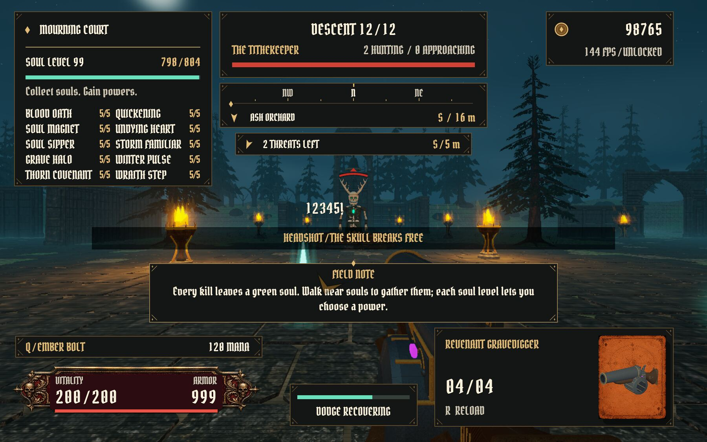

## Field tips

`src/tips.rs` shows six first-run notes, each the first time its moment comes: movement, sprint and dodge when the first run starts; reload and melee when the magazine falls to a third; souls when the first soul drops; damage arcs the first time you're hurt; the Collector, packs and the Binding on the first shop visit; and Ember Bolt once a chalice is bound. Arena notes sit in a panel below the reticle, clear of the crowd, the top-centre stack and the vitality plate, and last 10 seconds. The Collector's note sits over the dealer's robe for 40 seconds or until you leave the shop. Notes that come due together wait their turn. Each note uses the current key labels. The opening control reminder now uses the same panel and gives way to the first note.

Each species except the Ossuary Drudge also has a note (`Tip::Creature`), queued the first time one is alive within 30 m, within 0.7 radians of straight ahead, and in sight (`Game::sightings`, nearest first). In sight means a clear line from your eye to its head or chest past the walls and standing monuments that stop shots (`Game::in_sight`, using `world_layout::obstruction`); trees and small gravestones don't hide it. A creature first met behind a wall gets its note once it steps into the open. Its heading names the creature ("NEW CREATURE / BELL GARGOYLE") and its text is the bestiary's second and third lines: what it does and how to answer it. Creature notes last 7 seconds.

Seen notes are recorded as bits in `settings.json` (`tips_seen`): bits 0–5 for the field tips and 8–19 for the creatures, so older files show every creature note once. **Field tips** in Settings & Controls turns them off, and turning it back on clears the record so every note shows again. Smoke, review and practice runs never show notes or record them.

## Positional audio

Enemy sounds come from where they happen. Special-attack wind-ups, blasts and melee swings are panned with equal power by bearing relative to your view, attenuated with distance, and slightly softened behind you, so a threat out of sight can still be heard and located. Each special attack has its own wind-up cue, starting with its visible warning: a rising intake before caster bolts, a low growl before slams and plague bursts, a falling screech before dives, a hollow bell before a Bone Shepherd summons, and a reversed whoosh before a Tithe Reaper blinks. Your own weapons, pickups and interface sounds stay centred. The cues are synthesized like the other designed sounds; `--export-audio` writes them to `captures/audio/`.

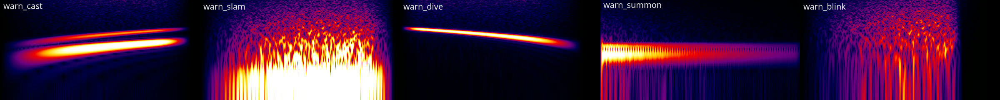

## Audio output

`src/output.rs` opens the sound device itself rather than through rodio's `OutputStream`, which printed every stream error with `eprintln!` (one failing ALSA device printed the same line 3.7 million times in under a minute) and never recovered. One rodio mixer lives for the whole session; the ambience, the score and every sound play into it. A thread named `audio-output` opens the default device with cpal (stereo 32-bit floats at 48 kHz if offered, otherwise the device's default, with channels and rate converted), feeds it from the mixer and watches it:

- A stream error prints one line, then at most one line every ten seconds with a count of the ones in between, and a count of any left when the stream closes.
- The stream is closed and reopened when the device reports it's gone, when errors come faster than one a second, or when the device hasn't asked for sound in two seconds (PipeWire's ALSA plugin just stops asking when the server goes away, with no error at all). Reopening, or opening at launch, retries after 1, 2, 4 and 8 seconds, then every 10; the reason it can't open is printed once.
- Every two seconds it checks the system's default device and moves when another device's name becomes the default. Under PipeWire or PulseAudio the default is always `default`, which already follows the system.
- While no stream is open, one-off sounds are dropped rather than queued, and the ambience and score pause where they are.

Opening a device can block (a starting or stuck sound server), so the main thread never waits on it.

`scripts/audio-review.sh` checks this against real ALSA and a real sound server without using the speakers. It runs `--audio-review` with `HOME` set to a throwaway folder under `captures/audio-review/`, whose `.asoundrc` makes PipeWire's ALSA plugin the default device, and `PIPEWIRE_RUNTIME_DIR` inside it, so nothing can reach the machine's own sound server. The review starts a private PipeWire (the stock configuration plus one null sink) and WirePlumber (no hardware, no D-Bus, no saved state), then:

1. plays shots and the score and records the sink with `pw-record`, checking they're linked and audible;
2. pushes a million copies of a `POLLERR` error through the stream's error handler (simulated: the private server can't make ALSA report one), checking the stream closes and reopens;
3. stops the server under the open stream, checking the stream closes, the game keeps running and every reopen fails quietly;
4. starts the server again, checking the game's own retry reopens it and the recording has the ambience and score before any new sound, then new shots.

The script fails if the log has more than 40 lines, or more than 20 from the audio output, and copies the recordings and server logs to `captures/audio-review/`. It needs `pipewire`, `wireplumber`, `pw-record`, `pw-link` and PipeWire's ALSA plugin, and stops any server it leaves behind (only processes whose environment names its own throwaway folder).

## Combat feedback

The reticle (`reticle` in `src/ui.rs`) is four ticks and a centre dot over a dark outline one pixel wider on every side, so it reads on pale stone, bone and firelight as well as on the night. **Reticle size** (100, 150 or 200%) and **Reticle colour** (ivory, the original, or green, yellow, cyan or magenta) are on the journal's Preferences page and saved in `settings.json` (`reticle_size`, `reticle_color`); older files load as 100% ivory. Stroke widths are whole pixels, centred on a pixel or between two, so a 1-pixel tick is one sharp row instead of two half-strength ones (the original reticle sat on the boundary between two rows at 1440×900). Firing still widens the gap. `the_reticle_is_outlined_so_it_reads_on_a_pale_surface` rasterizes egui's own triangles for every size and colour on an ivory background and checks that each tick and the dot cross as background, outline, full colour, outline, background; the `hud-reticle-*` text-review fixtures show it over a drudge's ribcage.

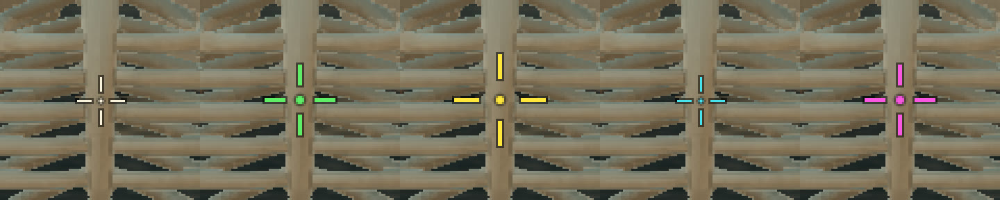

Your own weapon hits flash a marker around the reticle: ivory for a body hit, gold for a headshot, and a larger red mark with a short tick for a kill. Pellets and splash that land together show the strongest result and tick once. Automatic powers do not trigger markers. When you take damage, a red arc around the reticle points toward each source (the striking enemy, a blast's caster, or the direction a projectile came from) and fades over 1.2 seconds; up to four arcs show at once. **Reduce flashes** in Settings & Controls softens the full-screen hurt vignette and muzzle lighting to 35%.

Special attacks winding up out of view get an amber chevron outside the damage arcs (`Game::unseen_threats`, drawn by `threat_pointers` in `src/ui.rs`). It covers attacks aimed at the player: Cinder Skull and Ash Cantor casts, Gloamwing and Bell Gargoyle dives (including the dive itself), Tithe Reaper blinks, and the Tithekeeper's slam or a Plague Vessel's burst when the player is within 1.5 m of the marked circle. Bone Shepherd summons don't count. "Out of view" means more than 92% of the horizontal half field of view off centre, so an attacker at the frame's edge still gets one. Chevrons grow as the warning runs down, pulse faster as it nears (steady with **Reduce flashes**), and vanish when the attack lands or the creature dies. At most four show, the most urgent first. The `hud-offscreen-warnings` text-review fixture shows three beside a damage arc and an in-view cast.

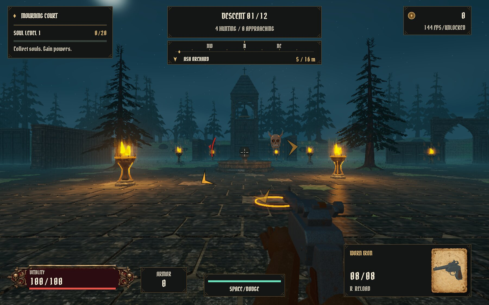

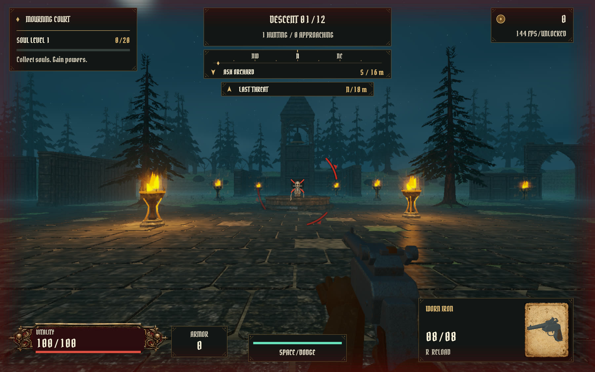

## Text legibility review

HUD numbers and labels have dedicated opaque dark surfaces, with armor separate from the ornamental vitality plate. Card text is printed in dark ink on a neutral parchment field independent of rarity. Folios soften their background engraving behind reading areas. Every control uses Gravewake Gothic, including compact labels and numbers; long card names and prose wrap using measured font widths. Generic labels and paragraphs have an 18-design-unit floor, with a minimum of 13.5 logical points after window scaling. The title glyph shapes and spacing are preserved exactly.

`cargo run --release -- --text-review` captures the actual native UI in 116 screenshots across 113 fixtures: every weapon, every creature, every power description, all four rarities, stressed HUD values, reload/melee, hit markers and damage arcs, the reticle at each size and colour over bone, off-screen attack warnings, the busiest HUD at 80, 100, 110, 120 and 130%, the controller cursor after D-pad presses, a Collector offer with a trait line, the Collector's preview of descents 4, 8 and 14, a 90° field of view, controller prompts (default and remapped), the Keyboard and Controller pages, title records and the chronicle, pack opening, upgrade tooltips, settings (with a 144 FPS frame limit), confirmation, pause (plain, and the ledger early in a run, with every power and a notice, and in practice), a first-sighting creature note and endings with their run summaries. Add `--review-small` for 960×600. Results and a manifest go to `captures/legibility/normal` or `captures/legibility/small`. Set `GRAVEWAKE_REVIEW_ONLY=hud-size,pack` to capture only fixtures whose names contain one of the comma-separated parts (numbering then starts at 00). Review fixtures freeze combat and never load or write player saves.

## Blender creature and cemetery overhaul

All twelve creatures now use original Blender meshes: recessed skull cavities, separate mandibles and teeth, curved ribcages, shaped pelvis and joints, articulated hands and feet, thicker forged armor, folded garments, cupped wing membranes, lantern cages, and curved blades. Their meshes share the existing anatomical pose, so headshots, dismemberment, injury poses and ragdolls use the same body parts visible in gameplay. Animation remains a rigid segmented rig; garments do not use cloth simulation.

The cemetery uses eleven Blender assets for conifers, carved grave markers, masonry, buttresses, a fitted pointed arch with iron tracery, and hollow bowl braziers. Near trees have individual needle bundles and gaps between twigs. Collision and fire locations are preserved. The masonry, buttress and gate exports are kept in `assets/environment/` with their Blender source, but the world doesn't draw them, so they aren't embedded in the executable.

Editable sources are `assets/blender/gravewake-creatures.blend`, `assets/blender/mournhollow-environment.blend`, and `assets/blender/weathered-armory.blend`. Rebuild creatures with `./scripts/build-creatures.sh`, scenery with Blender's `--background --python scripts/build-environment.py`, and weapons with `./scripts/build-weathered-armory.sh`. Asset manifests and provenance live in the corresponding `assets/enemies`, `assets/environment`, and `assets/weapons` directories.

Creature geometry stays in indexed GPU buffers. Only rig transforms and combat state are uploaded each frame; lower-detail Blender exports are selected beyond eight and fourteen meters. Full geometry remains available for close views and detached body parts.

`cargo run --release -- --model-review` produces twelve close creature portraits, an environment overview, three weapon views, and a 48-enemy rendering stress capture in `captures/models/after`. The manifest reports 240 timed frames after 60 warm-up frames, excluding screenshots. AI is frozen in this diagnostic; it is a rendering comparison, not a full gameplay benchmark. `--model-cpu` exercises the full-detail CPU fallback in a separate gallery. Review fixtures never load or save player progress.

## Start-up stall watchdog

Smoke, review and benchmark runs start a watchdog thread (`src/watchdog.rs`). Start-up steps (window, egui, GPU surface, adapter, device, renderer) and each frame's surface acquire, screenshot read-back and present report progress. After 120 seconds without progress (override with `GRAVEWAKE_WATCHDOG_SECS`), it prints the last step and frame number and aborts, so systemd-coredump keeps a core with every thread's stack. Normal play never starts it. Only a completed frame counts as progress: the steps inside a frame name themselves in the report but don't reset the timer, so a surface that keeps coming back lost or outdated (which scripted runs log once) also trips the watchdog. Before round 5, those failed frames counted as progress.

The report is written to `captures/watchdog-<pid>.txt` first and printed from a separate thread, and the abort goes ahead two seconds later whether or not the print finished. Before round 6 the watchdog printed with `eprintln!` and then aborted, so if stdout and stderr were a pipe that had stopped draining, the main thread blocked on its next line, the watchdog blocked on its report, and nothing aborted. A temporary injected stall (a run filling such a pipe, with a 10 s limit) reproduced that: an outer `timeout` killed it at 60 s with status 124 and no report, as in round 5's one hung controller smoke run. With the change, the same run aborted with status 134 two seconds after the limit and left the report file and a core. Whether that was round 5's cause isn't known.

`scripts/stall-hunt.sh [runs]` alternates plain and controller smoke runs from a private copy of the release binary. It writes capped logs and `summary.tsv` to `captures/stall/`, and saves `coredumpctl info` and gdb `thread apply all bt` output for any run that fails. If a run outlives `HUNT_TIMEOUT` seconds (default 900), the script first saves its process and per-thread states and kernel wait channels from `/proc` (`-proc.txt`), then sends SIGABRT (and SIGCONT, in case the process is stopped) so a core is kept, and SIGKILL 30 seconds later if it's still there. `HUNT_OUT` changes the output folder.

## Testing in a private compositor

`scripts/nested-kwin.sh [--size 1920x1080] -- <command>` runs one command inside a private KWin (`kwin_wayland --virtual` on its own D-Bus session, with no real outputs or input devices) and exits with the command's status. Test windows, and any switch to fullscreen, stay inside it instead of appearing on the desktop you're using, which matters on a shared machine. The game renders there through the real GPU (Vulkan on the Radeon 8060S), and `scripts/fullscreen-review.sh` uses it. Captures are taken from the game's own frames, so they match a normal desktop run at the same window size, apart from the desktop's scale factor (the virtual output uses 1). For example:

```sh
XDG_DATA_HOME=$PWD/captures/home scripts/nested-kwin.sh -- cargo run --release --locked -- --text-review
```

It needs KDE Plasma 6's `kwin_wayland` and `dbus-run-session`; working files go under `captures/` and are removed afterwards. The private KWin runs in a session of its own (`setsid`), and when the command ends the script lists and stops anything still running in that session, such as a helper its D-Bus bus started on demand (round 10's test desktops left about 80 `ksecretd` processes behind), so a run leaves nothing running; processes outside that session are never touched.

`--fake-input` lets clients of that private KWin inject key and mouse events through KWin's `org_kde_kwin_fake_input` protocol: it starts KWin with `KWIN_WAYLAND_NO_PERMISSION_CHECKS=1` (only that KWin; the desktop in use is unaffected) and sets `GRAVEWAKE_FAKE_INPUT=1` inside.

## Keyboard layout

Bindings store physical keys, so a label is only right for the player's layout once the game knows what each key types. Pressing a bound key teaches it (`Bindings::learn_glyph`). Under Wayland on Linux, `src/keymap.rs` also reads the layout at startup: a thread opens a second Wayland connection, asks the seat for a keyboard, takes the XKB keymap the compositor sends every client and compiles it with the libxkbcommon winit already loads (through `xkbcommon-dl`), then reads the character each bindable key types unshifted on the first layout. The game names keys after them as soon as they arrive (`Game::use_layout`), after a key is rebound, and after **Restore default keys**. Dead keys and keys that type nothing keep their own names. With several layouts configured, only the first is read. On X11 and macOS nothing is read; under Wayland without a keyboard on the seat or without libxkbcommon, it prints why once. Either way labels behave as before. Scripted runs keep the default names, apart from the review below.

`scripts/layout-review.sh` runs `--layout-review` in the private KWin twice, with `--layout us` and `--layout fr` (`scripts/nested-kwin.sh` writes a `kxkbrc` for the private KWin into its own throwaway config folder). Each run starts a game, waits for the layout, checks the opening banner's movement label (W A S D, then Z Q S D) before any key is pressed, and saves a capture to `captures/layout/`. The unit test `keymap::tests::key_names_follow_the_compositors_layout` compiles the `us` and `fr` layouts with libxkbcommon and checks the labels (it says it's skipped if the library or its layouts are missing).

## Real key presses

`scripts/input-review.sh` builds the release binary and runs `--input-review` in the private KWin with `--fake-input` and a throwaway `XDG_DATA_HOME`. The game runs as a normal session: saves on, scripted input off, every key and mouse handler in `main.rs` live (only the controller is left out, so a pad on the machine can't interfere). `src/input_review.rs` opens a second Wayland connection to the compositor and sends Linux key and button codes through fake input, so they arrive through Wayland, winit and the game's handlers as a keyboard's and mouse's would. After each press it waits for the game to react (up to 600 frames, then it fails):

- a new run started over a saved, unfinished descent-3 run (through `Game::new_run`, as the title's confirmation does) leaves it in `records.json`'s chronicle as abandoned;
- Escape pauses and resumes;
- with **Sprint / Hold**, W and Shift move and sprint, and sprint ends when Shift is released while W stays down; with **Sprint / Toggle**, a Shift tap (press and release sent together) starts sprinting, it stays on for 30 frames, and the next tap stops it;
- with the Keyboard page waiting for Reload's key (set directly, as a click on its button leaves it), a T press binds Reload to T, then an E press binds it to E and moves Melee to T, the page notes the swap, `settings.json` holds the new bindings when the journal closes, and E then starts a reload in the arena;
- a quick left click (press and release together) fires once, a held one keeps firing, and 200 counts of mouse motion turn the view 0.5 rad at the default sensitivity;
- F11 goes fullscreen at the output's size and back to the 1440×900 window, and `settings.json` records each;
- with the Keyboard page waiting for Fire's key, an F press binds Fire to F and leaves the left button free; back in the arena a left click doesn't fire and an F press does; then, with the real pointer placed on Fire's button (the window's position found from where the output's centre lands in it), one click waits for a new input and a second binds Fire to the left button, `settings.json` holds it when the journal closes, and a left click fires again.

It then quits through the normal save-and-quit path. Captures and the log go to `captures/input/`. Like the fullscreen review, it refuses to run outside that compositor or without a throwaway data folder (`input_review::refusal`). Its first run found that a tap whose press and release both landed between two frames was never seen, since sprint and the left mouse button were read once per frame from what was held: toggle sprint didn't start and a quick click didn't fire. Both now latch a press until the next frame (`sprint_pressed`, `fire_pressed` in `main.rs`); with the fire latch removed, the review fails waiting for the quick click. KWin injects the events, so this isn't a physical keyboard on a real Plasma session, and controller buttons aren't exercised.

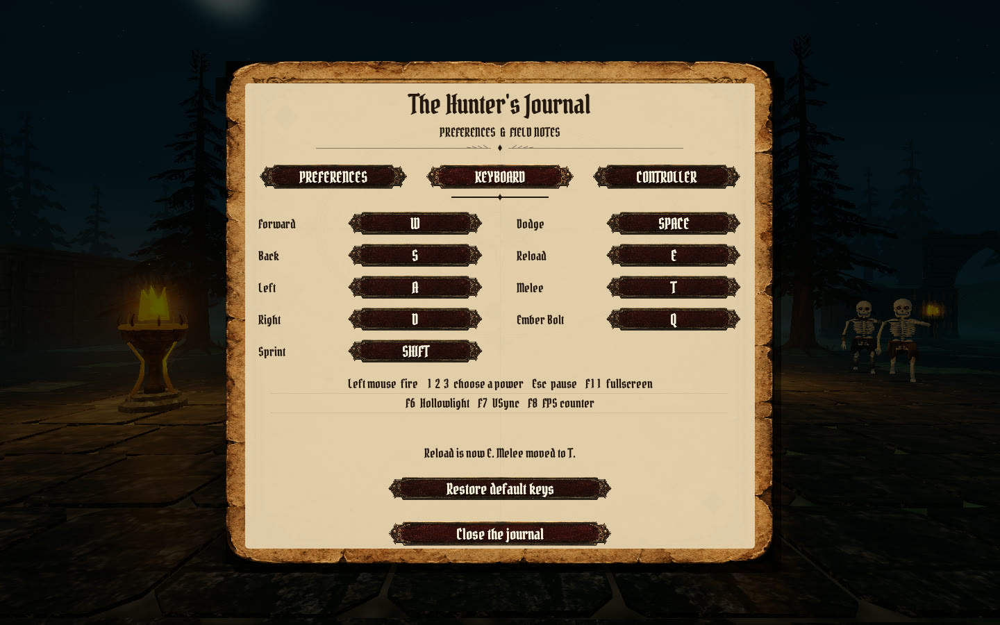
