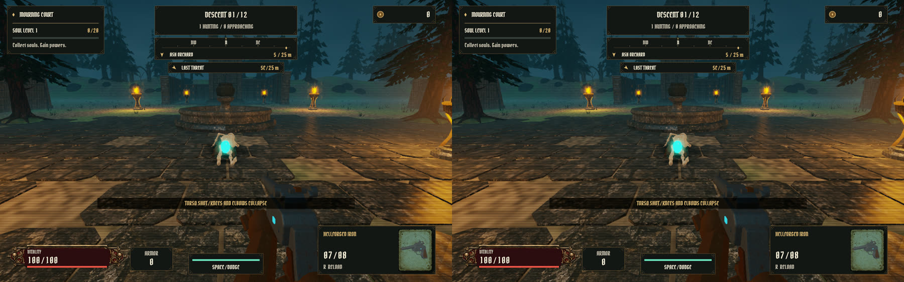

# Resident corpse sections (round 4)

Corpse sections (intact ragdoll sections and fracture fragments) keep fixed body-space vertices. Until round 4 the optimized renderer still transformed every one of those vertices on the CPU each frame and re-uploaded them: about 527,000 vertices with 14 corpses. Now each section's vertices are uploaded once, when it appears, into a resident vertex buffer, and each frame writes one matrix per visible section: the rigid-body pose plus the end-of-life shrink. `piece_vs` in `shaders/world.wgsl` applies it, and turns normals without the shrink's scale, as the CPU path did. Ground shadows, frustum culling and lifetimes are unchanged. Expired sections leave holes in the buffer. When it fills, the live sections are packed again from the start, and the buffer doubles if they need more than half of it, up to the device's buffer size limit (256 MB with wgpu's default limits, about 4.4 million vertices). If live sections ever exceeded that limit, those that don't fit would be skipped rather than crash the renderer. The 144-section pool makes that unlikely: the 14-corpse scene uses about 0.5 million. Section ids are unique per process, so a reset `Bones` can't reuse stale geometry.

Measured on the Linux test machine (Radeon 8060S, Vulkan, Wayland, 1440 × 900 logical) in one release binary, alternating `GRAVEWAKE_CPU_CORPSES=1` (the old CPU expansion, kept as a diagnostic switch) with the default path. The shared machine was busy: load averages were 20–23 for the first two pairs and 18 for the third.

| Optimized corpse scene (24 enemies + 14 corpses) | CPU expansion (3 runs) | Resident sections (3 runs) |
| --- | ---: | ---: |
| Mean dynamic mesh CPU time | 7.44 / 6.46 / 5.51 ms | 0.90 / 0.85 / 0.65 ms |
| Mean submit time (uploads, encoding, UI) | 3.97 / 2.86 / 2.67 ms | 0.78 / 0.78 / 0.33 ms |
| Dynamic vertices uploaded per frame | 527,310 | 41,790 |
| Mean frame rate | 61.2 / 66.2 / 68.1 FPS | 65.9 / 73.5 / 344.2 FPS |
| Frame rate relative to the 12-enemy scene in the same run | 73% / 99% / 46% | 71% / 91% / 80% |
| p95 frame interval | 24.0 / 21.8 / 30.1 ms | 35.0 / 26.6 / 3.6 ms |

The CPU cost of the corpse scene now matches the 12- and 48-enemy scenes (0.5–1.0 ms mesh time). Frame rates depended mostly on presentation, which varied from run to run on the shared desktop: in the first two pairs, surface acquisition took 2–12 ms per frame and capped every scene, so the corpse path made little difference. In the third pair, presentation was fast (1.3 ms acquisition in the resident run). There, even the corpse-free 12-enemy scene ran at 147 FPS in the CPU run and 432 FPS in the resident run, so compare the corpse scene with the 12-enemy scene in the same run: it ran at 46% of that scene's rate with CPU expansion and 80% with resident sections, and its p95 frame interval fell from 30.1 ms to 3.6 ms. The final verification benchmark (resident path, load 19) measured 275, 257 and 223 FPS for the 12-enemy, 48-enemy and corpse scenes. The remaining corpse-scene cost is mostly physics (about 1.8 ms). GPU time wasn't measured separately. Sources: `captures/performance/round4-{cpu,gpu}{1,2,3}.json` and `round4-final.json`.

The two paths render the same image. In the benchmark's corpse capture, the mean pixel difference is under 0.0001/255, and 0.009% of pixels differ by at most 2/255. Across the anatomy review (decapitation, disarm, limp and crawl, a ten-body collapse, then fractures and an explosion), every frame up to the fracture scene has an MSE under 0.005 between the two paths. After that, the physics itself diverges: two runs of the same path also first differ at the same frame, so the anatomy review's fracture scene isn't deterministic run to run (a pre-existing issue). A unit test checks the instance transform against the CPU expansion for every visible vertex, and another drives the buffer through 400 steps of piece churn.

# Articulated ragdoll performance

After the ragdoll/fracture pass, the release benchmark was rerun on the Apple M4 Max with Metal at 1440 × 900 and full Hollowlight effects. The optimized 24-enemy fixture plus 14 complete articulated corpses (140 physical sections, 126 joints) averaged **60.0 FPS**, with a **17.82 ms p95** frame interval. Mean simulation time was **0.774 ms**, and dynamic mesh construction took **2.609 ms**. Physics now advances at 120 Hz. The 12- and 48-enemy scenarios averaged 60.0 and 60.1 FPS respectively. Source: `captures/performance/ragdoll.json`.

Each scenario measures 300 frames after 120 warm-up frames, excluding screenshot readbacks. This fixture measures steady rendering and physics after bodies spawn; it does not measure the cost of simultaneous new mesh fractures or guarantee every combat frame. The current ten-section bodies fill the 144-piece pool with 14 complete corpses; this differs from the older six-section baseline below. MacOS drawable acquisition dominates the current visible measurements, despite AutoNoVsync being requested.

# Expanded world performance

The current 96 × 96 m world was measured on the Apple M4 Max, Metal, a release build and full Hollowlight effects. The native world tour moves through the districts using the real game update loop, then simulates a scenario initialized with 48 enemies in the eastern cloister. AI and body physics advance; player health is protected and the fixture does not fire. This is a bounded scenario, not a worst-case guarantee for every late-game power combination.

| Current visible scenario | Result |
| --- | ---: |
| Native resolution | 1440 × 900 |
| Mean visible frame rate | 61.5 FPS |
| Mean frame interval | 16.26 ms |
| p95 frame interval | 18.88 ms |
| Mean simulation CPU time | 0.109 ms |
| Mean dynamic mesh CPU time | 0.706 ms |
| Mean surface acquisition time | 14.28 ms |

239 measured frames exclude 60 warm-up frames and screenshot readbacks. AutoNoVsync is requested, but macOS presentation still dominates this visible run. Source: `captures/world/normal/manifest.json`. The tour also verified 184.9 metres of continuous movement, six arrival stops, wall contact and final-threat orientation.

Static world triangles are now indexed into spatial visibility batches with conservative bounds. The renderer retains distant detail but skips batches outside the camera view. Eighteen braziers use the six nearest point lights, preserving the shader's light-loop budget. Soft glows and ground shadows render after opaque surfaces without depth writes, fixing fog artefacts.

Use `cargo run --release --locked -- --world-review` to reproduce the visible run. Add `--world-offscreen` to bypass drawable acquisition and wait for each GPU submission to complete. That mode measures serial simulation/rendering latency; its reciprocal throughput is **not visible display FPS**. Add `--review-small` for the 960 × 600 legibility pass. See `WORLD-REVIEW.md` for scene captures and movement validation.

---

# Earlier arena performance baseline

Measured on the local Apple M4 Max using Metal, a release build, 1440 × 900, full Hollowlight effects and AutoNoVsync. These are average rendered FPS, not a promise about monitor refresh or every individual frame. macOS presentation scheduling and other desktop activity affect results.

| Scenario | Original release FPS | Optimized FPS | Original mesh CPU time | Optimized mesh CPU time |
| --- | ---: | ---: | ---: | ---: |
| 12 enemies | 120.0 | 120.0 | 2.90 ms | 0.91 ms |
| 48 enemies | 56.4 | 119.2 | 10.26 ms | 2.08 ms |
| 24 enemies + 144 ragdoll sections | 65.3 | 118.7 | 7.42 ms | 2.93 ms |

Original measurements: `captures/performance/before.json`. Final measurements: `captures/performance/final.json`. A same-window comparison in the final executable also runs the CPU reference path with shared primitive caching and allocation reuse already applied: it measured 67.2 FPS for 48 enemies and 88.2 FPS for the ragdoll scene, versus 119.2 and 118.7 FPS with instancing and visibility checks. Treat the original-to-final comparison as a local benchmark, with the paired run providing an additional controlled comparison.

## Changes

- Full-detail enemy ellipsoids (skulls, joints, eye sockets, armor and emissive details) share one GPU vertex buffer. Each shape uploads a transform, radii, color and material instead of hundreds of expanded vertices. Mesh topology, enemy counts and shader quality are retained.
- Cached primitive trigonometry and reused frame allocations. Per-triangle transformed normals are computed once instead of once per corner.
- Conservative camera-frustum checks skip rendering offscreen enemies, body pieces, particles and orbs. Their simulation, attacks, physics, collision and pickups continue normally; attack warnings remain visible when their area is on screen.
- Bullet traces reject enemies outside a conservative bounding sphere before constructing detailed animated hit capsules.
- Unlocked presentation is the default, with safe platform fallback. F7 toggles VSync, F8 toggles the FPS counter. Both controls are also in Settings & Controls and persist in `performance.json` alongside the existing save files.
- Occluded/minimized windows suspend continuous rendering and wake when visible, rather than consuming GPU time behind other windows.

## Reproduce

Run `./scripts/benchmark.sh`. It uses disposable game state and does not write the player's run or settings. Each of three deterministic workloads warms up for 120 frames and measures the next 300, first through the CPU reference renderer and then the optimized renderer, in the same window. Six reference screenshots are taken during warmup, outside measured samples. JSON results are written to `captures/performance/latest.json`; set `GRAVEWAKE_BENCH_LABEL` to preserve another named result.

Frame timing includes presentation/acquisition and therefore is not an isolated GPU timer. Mesh and simulation timings are CPU measurements; submit time includes upload, command encoding, interface rendering, and presentation. `max_vertices` counts CPU-expanded dynamic vertices, excluding the shared instanced topology.

Matched reference/optimized crowd screenshots have a 63.84 dB full-frame PSNR; visible geometry, textures and lighting were also inspected. Small differences arise from equivalent floating-point transforms and draw order. No resolution scaling or lower-detail models were used for these results.

Validation also includes the existing combat, progression, dismemberment, physics, and weapon tests, plus geometry equivalence, frustum bounds, frame allocation reuse, and non-mutating render tests. The native shader review exercises the VSync and FPS controls through actual UI clicks.
