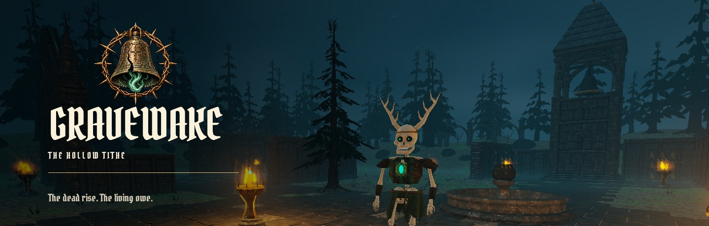
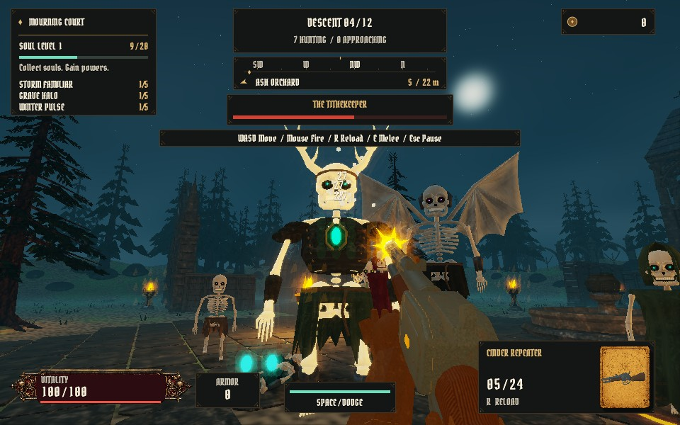
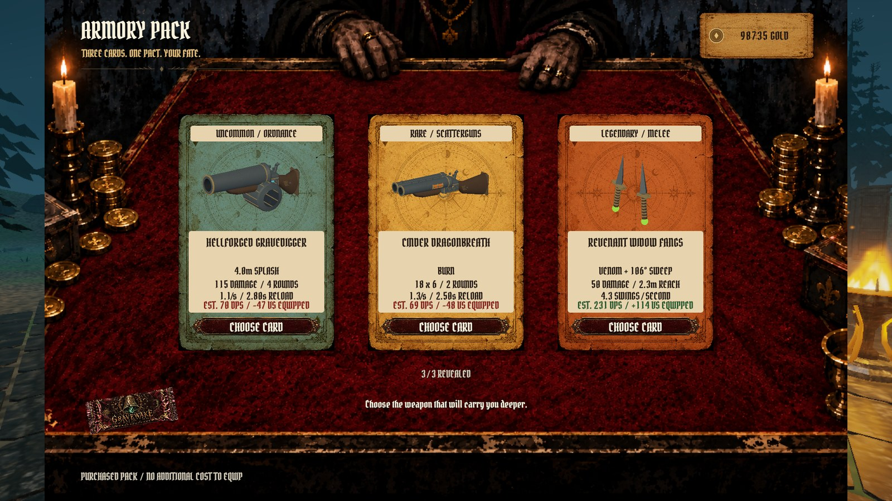
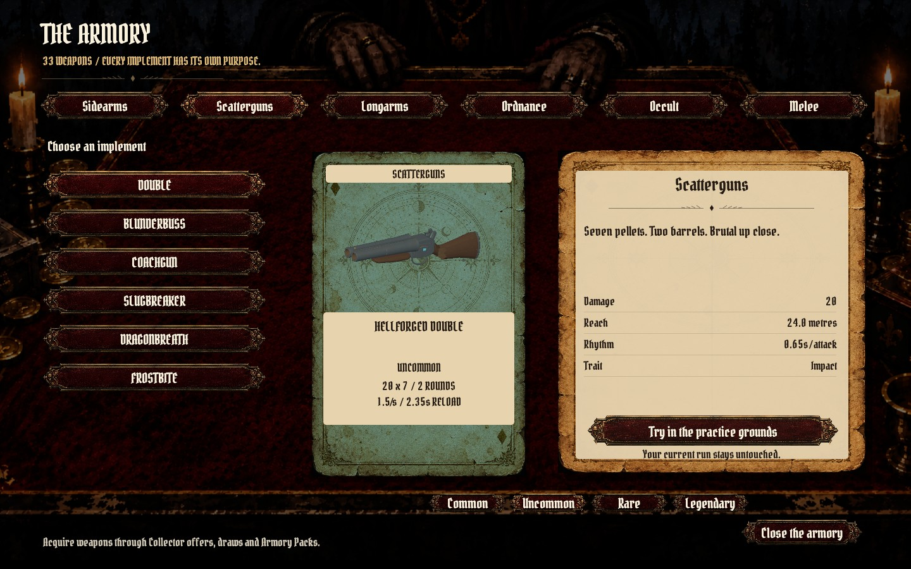
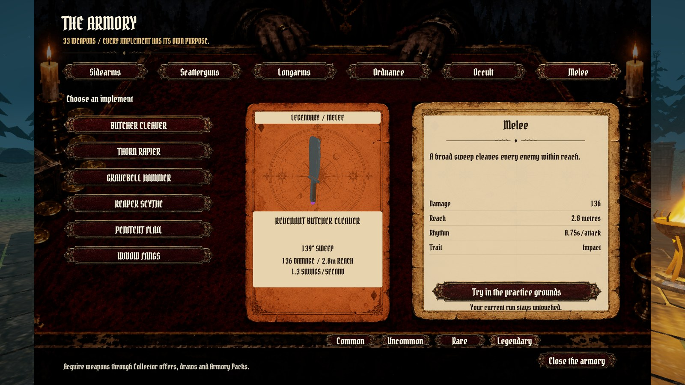
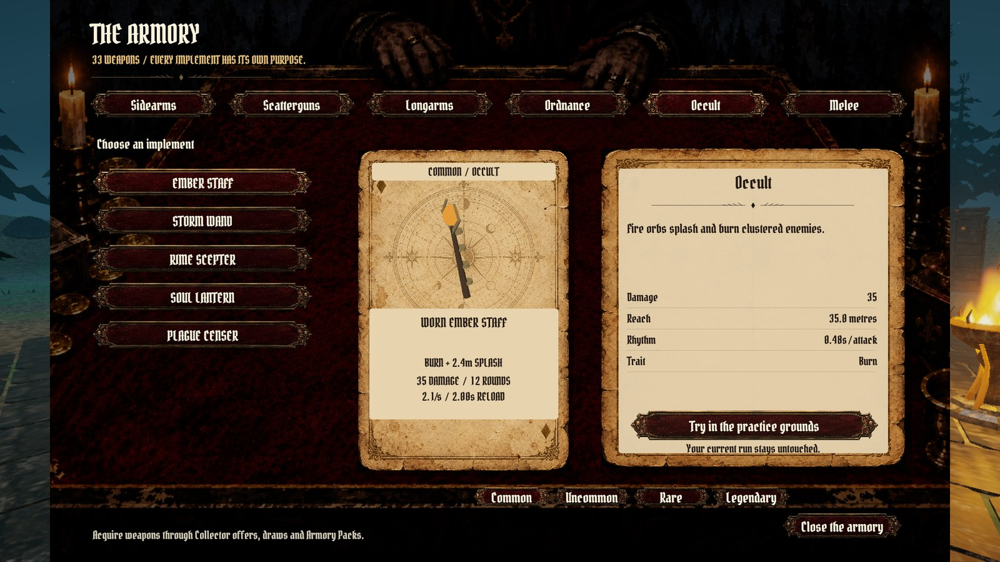
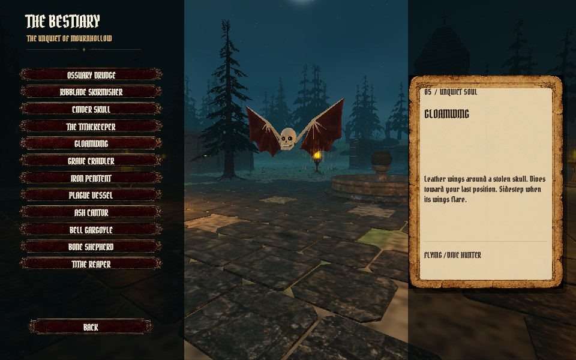
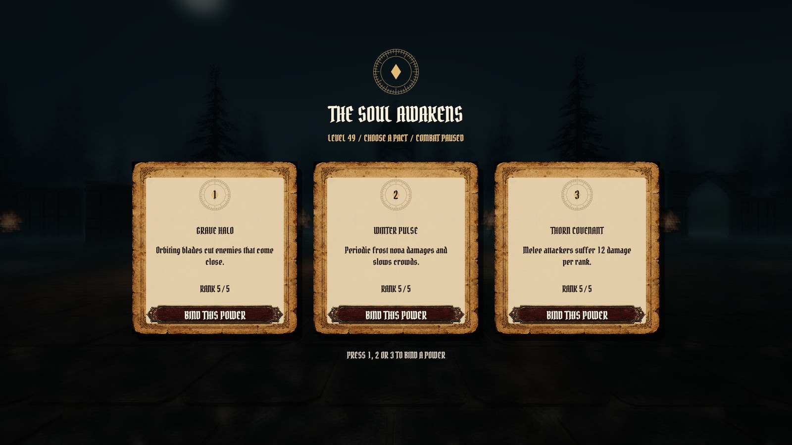
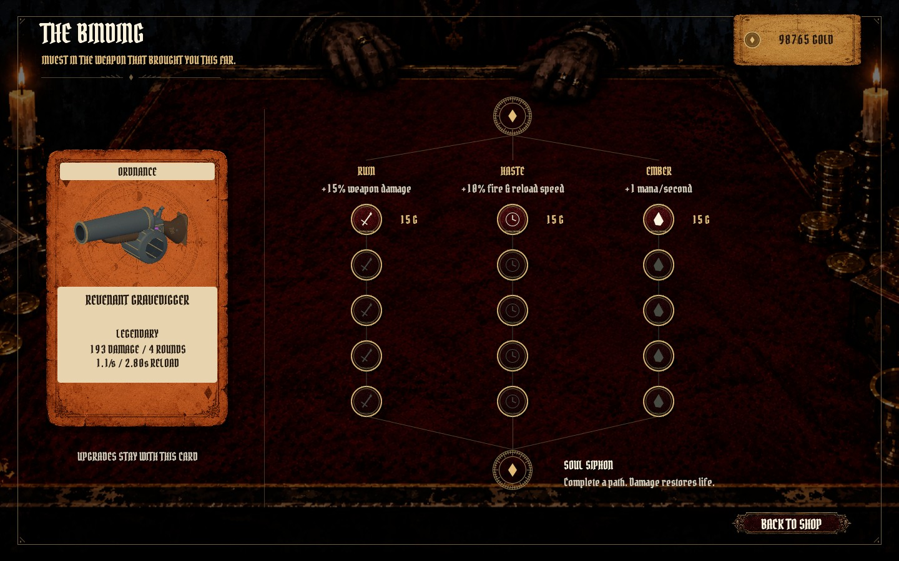

<p align="center"></p>

# Gravewake — The Hollow Tithe

**The dead rise. The living owe.**

A first-person gothic arena roguelite built in Rust. Fight through a ruined cemetery, tear open weapon packs at the Collector’s table, and turn the souls of the dead into a build that can survive the next descent.

**33 weapons · 12 enemy archetypes · 10 soul powers · 12 descents, then endless survival**

## Gameplay trailer

https://github.com/user-attachments/assets/62d76819-113a-4027-846c-11784dbf16fa

[Watch / download the full 42-second trailer](https://github.com/nearbycoder/gravewake/raw/refs/heads/main/docs/media/gravewake-trailer.mp4) · [Screenshot gallery](#inside-mournhollow) · [Build and play](#build-and-play)

The 42-second trailer above was captured from the native game with in-game sound. The trailer edits together staged gameplay encounters, actual pack interactions, reloads, physics, and armory views. No reference-game footage or prerendered combat is used.

## Answer the bell

- **Survive Mournhollow.** Move, sprint and dodge through a 96 × 96 metre arena connecting a ruined chapel, cloister, bell sanctuary, grave orchard and open court. Ground hunters, flying creatures, summoners and bosses pressure different parts of your build.
- **Make every shot count.** Head and limb hits have different consequences. Severed arms weaken attacks, injured legs cause limping or crawling, and articulated ragdolls and fractured remains react to later impacts.
- **Find your weapon.** Six families span revolvers, scatterguns, automatic weapons, grenade launchers, occult implements and melee. Burn, frost, venom, piercing, chain lightning and life drain change how you fight. [Browse all 33 weapons.](ARMORY.md)
- **Visit the Collector.** Spend earned gold on equipment and supplies. Tear a pack, reveal three cards, then choose one to equip. Four rarities and individual upgrade paths give each weapon room to grow.
- **Harvest souls.** Every kill drops experience. Level up to choose powers such as orbiting blades, lightning, frost pulses and stronger pickups. Clear twelve descents, face the Tithekeeper, then continue into endless survival.

## Inside Mournhollow

<table>
<tr>
<td width="50%"><br><b>Hold the line.</b> Flying and ground enemies close in while powers and gunfire cut through the crowd.</td>
<td width="50%"><br><b>Three cards. One choice.</b> Open packs and equip the weapon that fits your next descent.</td>
</tr>
<tr>
<td><br><b>Worn iron and black powder.</b> Inspect weapons and try them in the practice grounds.</td>
<td><br><b>Get close.</b> Cleavers, rapiers, hammers, scythes, flails and venomous blades.</td>
</tr>
<tr>
<td><br><b>Bind something stranger.</b> Fire, frost, lightning, poison and stolen life.</td>
<td><br><b>Know what hunts you.</b> Twelve creature types, each with its own silhouette and behavior.</td>
</tr>
<tr>
<td><br><b>Build a pact.</b> Combat pauses while you choose the next soul power.</td>
<td><br><b>Strengthen your favorite.</b> Invest in damage, speed and mana, then unlock Soul Siphon.</td>
</tr>
</table>

## Build and play

**Current target: native macOS.** Tested on Apple Silicon with Metal. This is a playable development build, not a finished commercial release. Windows, Linux and browser builds have not been validated. Keyboard and mouse are required.

### Requirements

- macOS with a Metal-capable GPU. The app bundle declares macOS 13 or later; current validation was performed on Apple Silicon.
- [Rust and Cargo via rustup](https://rust-lang.org/install.html), using the current stable toolchain. The project uses Rust 2024; the published snapshot was tested with Rust 1.99.
- Apple’s Command Line Tools (`xcode-select --install`) for the linker and macOS SDK.

### Run from source

```sh
git clone https://github.com/nearbycoder/gravewake.git
cd gravewake
cargo run --release --locked
```

The first build downloads dependencies and compiles the engine. Subsequent launches are faster. Release mode is recommended for gameplay. Models, textures, fonts, shaders and sounds are embedded at compile time; no asset downloads or Blender installation are needed to play.

### Build a macOS app

```sh
./scripts/package-macos.sh
open dist/Gravewake.app
```

After packaging, open `dist/Gravewake.app` or double-click `Play Gravewake.command`. The bundle is locally ad-hoc signed, not Developer ID notarized. Re-run the packaging script after changing source or assets; the launcher reuses an existing bundle.

## Controls

| Input | Action |
| --- | --- |
| W A S D / mouse | Move / look |
| Left mouse | Fire or use the equipped melee weapon |
| R | Reload |
| Shift / Space | Sprint / dodge |
| E | Melee attack |
| Q | Ember Bolt after binding a Hollow Chalice |
| 1 / 2 / 3 | Choose a soul power when leveling |
| Escape | Pause / back |
| F11 | Fullscreen |
| F6 | Toggle Hollowlight shader treatment |
| F7 / F8 | Toggle VSync / FPS counter |

Change mouse sensitivity, volume, lighting intensity and presentation settings in **Settings & Controls**. Losing focus pauses combat and releases the pointer.

Choose **Quit Game** from the title, or **Save & Quit Game** from the pause menu. **Cmd+Q** and closing the window also save and exit. **Continue Your Descent** restores the active run. Practice mode preserves your existing run.

## Saves

Progress lives in `~/Library/Application Support/Gravewake/run.json`; graphics and performance preferences live alongside it. Quitting, pausing, purchases and completed descents save progress. A new run replaces the active run after confirmation. Diagnostic capture modes use disposable state and do not overwrite player saves.

## Under the hood

A custom Rust game layer and renderer using **wgpu**, **winit**, **egui**, **Rapier 3D**, and **rodio**. Features include GPU-instanced creature geometry, visibility batches, fixed-step body physics, custom WGSL lighting and post-processing, authored Blender assets, and the embedded **Gravewake Gothic** font.

```sh
cargo test --locked
cargo run --release --locked -- --smoke
```

The tests cover combat, progression, saves, geometry and physics. The native smoke run opens a window, fights a wave, buys and opens a pack through actual UI input, equips a weapon, buys an upgrade and enters the next round. It requires a graphical session and writes screenshots under `captures/`.

See [development notes](DEVELOPMENT.md), [world design](WORLD-REVIEW.md), [physics](RAGDOLL-REVIEW.md), [performance](PERFORMANCE.md), [typography](FONT-REVIEW.md), and [trailer production](docs/TRAILER.md) for implementation and reproduction details. Raw diagnostic captures and build outputs are excluded from Git; the curated gallery and trailer are included.

## Credits and provenance

Gravewake began as a study inspired by **Dark Veil — The Blackwood**, by **Thomas Ricouard (@Dimillian)**. [Reference credits and original links](reference/SOURCES.md) are retained; supplied reference images, videos and prompt documents are not redistributed in this repository. This project is not affiliated with the original creator.

The UI uses generated artwork, including a shop backdrop adapted from the supplied reference screenshot; [art provenance](assets/PROMPTS.md) records that history. Creature, architecture and weapon source files and exports are included under `assets/`. [Recorded firearm and reload sounds](assets/audio/SOURCES.md) are CC0. [Gravewake Gothic](assets/fonts/SOURCES.md) is an adaptation of Pirata One under SIL OFL 1.1; all font notices are retained. See individual asset notices for their terms.
