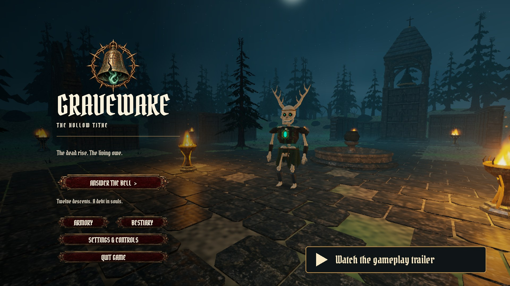
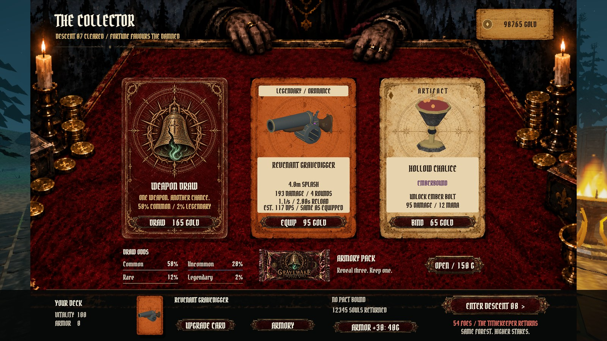
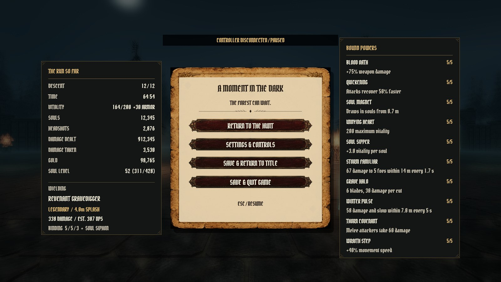
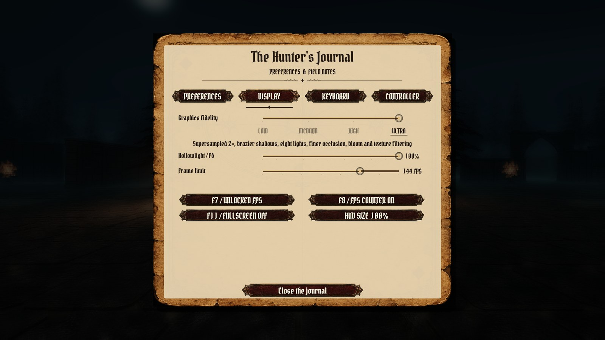
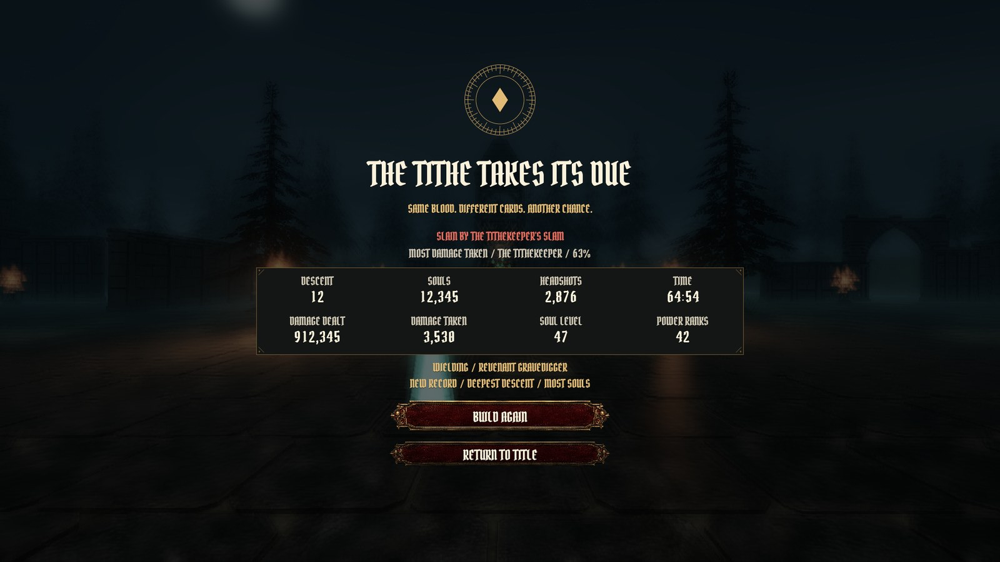

<p align="center"></p>

# Gravewake — The Hollow Tithe

**The dead rise. The living owe.**

A first-person gothic arena roguelite built in Rust. Fight through a ruined cemetery, tear open weapon packs at the Collector’s table, and turn the souls of the dead into a build that can survive the next descent.

**33 weapons · 12 creature types · 10 soul powers · 12 descents, then endless survival**

**[Play in your browser](https://nearbycoder.github.io/gravewake/)** in a current Chrome, Edge or Firefox, or on a phone or tablet with touch controls: a 16 MB download, saves kept in the browser. [What differs from the desktop game](#in-your-browser).

## Gameplay trailer

<p align="center"><a href="docs/media/gravewake-trailer.mp4"></a></p>

[Watch the 45-second trailer](docs/media/gravewake-trailer.mp4) ([download](https://github.com/nearbycoder/gravewake/raw/refs/heads/main/docs/media/gravewake-trailer.mp4), 1080p, 25 MB) · [Screenshots](#inside-mournhollow) · [Build and play](#build-and-play)

Every frame of the trailer is the game itself, recorded at the **Ultra** fidelity step on Linux: combat against mixed creatures, brazier fire and shadows, a break-open reload, location damage and fracturing remains, a pack torn open through the real menus, the Collector's preview of the next descent, a level-up, a first-sighting note, the pause ledger, the Display page, the death recap and the title's chronicle. The sound is the game's own effects, menu sounds, ambience and adaptive score, with no narration. Encounters are staged, scripted review runs rather than one continuous playthrough; the captions and the opening and closing cards are added in the edit. [How it's made](docs/TRAILER.md).

## Answer the bell

- **Survive Mournhollow.** Move, sprint and dodge through a 96 × 96 metre arena joining the Mourning Court, the Ruined Chapel, the Sunken Cloister, the Bell Sanctuary and the Ash Orchard. Ground hunters, flying creatures, summoners and the Tithekeeper press different parts of your build.
- **Make every shot count.** Head and limb hits have different consequences. Severed arms weaken attacks, injured legs cause limping or crawling, and articulated ragdolls and fractured remains react to later impacts.
- **Find your weapon.** Six families span revolvers, scatterguns, automatic weapons, grenade launchers, occult implements and melee. Burn, frost, venom, piercing, chain lightning and life drain change how you fight. [Browse all 33 weapons.](ARMORY.md)
- **Visit the Collector.** Spend gold on equipment and supplies. Tear a pack, reveal three cards and keep one. Each card names its trait (burn, venom and so on), how far one attack reaches (a splash's radius, how many creatures a shot pierces or a chain jumps to, a swing's arc), and its estimated damage per second against one creature compared with the weapon you hold. Four rarities and upgrade paths give each weapon room to grow. Beside the way out, the table tells you what waits below: how many creatures, whether the Tithekeeper is there, and which creatures you'll meet for the first time.
- **Harvest souls.** Every kill drops experience. Level up to choose powers such as orbiting blades, lightning, frost pulses and stronger pickups; combat waits while you choose. Clear twelve descents, face the Tithekeeper, then carry on into endless survival.
- **Every run is new, and remembered.** Each run draws its own seed and shuffles each descent's creatures. The ending screen names the blow that killed you and the creature that hurt you most and sums up the run. The title keeps your deepest descent, most souls and fastest victory, and a chronicle of your last five runs.

## Inside Mournhollow

<table>
<tr>
<td width="50%"><br><b>Hold the line.</b> Flying and ground creatures close in while powers and gunfire cut through the crowd.</td>
<td width="50%"><br><b>Three cards. One choice.</b> Each card shows its reach and how it compares with the weapon you hold.</td>
</tr>
<tr>
<td><br><b>Know what waits below.</b> The Collector previews the next descent: its size, its returning boss and its new creatures.</td>
<td><br><b>Build a pact.</b> Combat pauses behind a blurred veil while you choose the next soul power.</td>
</tr>
<tr>
<td><br><b>Worn iron and black powder.</b> Inspect weapons and try them in the practice grounds.</td>
<td><br><b>Get close.</b> Cleavers, rapiers, hammers, scythes, flails and venomous blades.</td>
</tr>
<tr>
<td><br><b>Bind something stranger.</b> Fire, frost, lightning, poison and stolen life.</td>
<td><br><b>Know what hunts you.</b> Twelve creature types, each with its own silhouette and behaviour.</td>
</tr>
<tr>
<td><br><b>Strengthen your favourite.</b> Invest in damage, speed and mana, then unlock Soul Siphon.</td>
<td><br><b>Take stock.</b> The pause ledger shows the run so far and what every power you hold does at its rank.</td>
</tr>
<tr>
<td><br><b>Set the look.</b> Four fidelity steps, Hollowlight strength, frame limit, VSync and HUD size on the Display page.</td>
<td><br><b>Learn from the fall.</b> Every ending names the blow that killed you and sums up the run.</td>
</tr>
</table>

All screenshots are native 1920 × 1080 frames at the Ultra step, from the same scripted captures as the trailer.

## Graphics, settings and accessibility

Open **Settings & Controls** from the title or the pause menu. Changes apply at once and are saved between launches.

**Graphics fidelity** (Display page) has four steps. High is the default and draws exactly what the game drew before the setting existed.

| Step | What it does | GPU time per frame* |
| --- | --- | --- |
| Low | 3D scene at 60% of the window's resolution, four brazier lights, no ambient occlusion, lighter mist, one bloom pass, no edge smoothing, simpler fire, reduced creature meshes from 5 m | 0.82 ms |
| Medium | 80% resolution, lighter occlusion and mist, simpler fire, reduced meshes from 6.5 m | 1.18 ms |
| **High** (default) | Full resolution (up to 1440 pixels wide), six lights, the standard Hollowlight composite | 1.43 ms |
| Ultra | Twice the resolution, supersampled (up to 3840 wide); shadows from the three nearest braziers; eight lights; finer occlusion, mist and bloom; sharper textures at glancing angles (16× anisotropic); denser fire; full creature detail out to 14 m | 7.31 ms |

\*The game's own world and composite passes at 1440 × 900 in a staged brazier scene, on the one GPU it was measured on (an AMD Radeon 8060S iGPU). Ultra costs about five times High, almost all of it from drawing four times the pixels. Details: [Graphics fidelity](DEVELOPMENT.md#graphics-fidelity).

**Display page:** graphics fidelity, Hollowlight shader strength (F6 toggles it), a frame limit (Off, or 30 to 240 frames per second; in the background the game draws at most 30), VSync (F7), the FPS counter (F8), fullscreen (F11; remembered between launches) and HUD size (80–130%; above 110% a compact layout keeps the larger panels apart). The first launch opens a 1440 × 900 window; a window you resize reopens at that size, and either is shrunk, keeping its shape, to fit 90% of a smaller screen (never below 960 × 600).

**Preferences page:** aim sensitivity (28–280% of the default), sound and music volume, field of view (60–90° vertical), invert look, flash reduction (a softer hurt vignette and muzzle light), first-run field tips, hold or toggle sprint, and the reticle's size (100, 150 or 200%) and colour (ivory, green, yellow, cyan or magenta, always with a dark outline so it shows on pale stone and bone).

**Readable combat.** Reticle marks confirm hits (gold for headshots, red for kills), red arcs around the reticle point to whatever just hurt you, and amber chevrons point to special attacks winding up out of view (dives, casts, blinks, and slams or bursts you're standing near), growing as the attack nears. Wind-ups, blasts and swings are positioned in stereo, and each special attack has its own warning sound.

**Help when you need it.** On your first run, short field notes below the reticle explain movement and dodging, reloading and melee, souls, damage arcs, the Collector and Ember Bolt as each first comes up, and the first time each kind of creature (other than the plain Ossuary Drudge) comes into clear view, a note names it and says how to fight it. Each note shows once; switch **Field tips** off, or back on to see them all again.

**Menus and sound.** Menu buttons tick when the pointer or focus frame reaches them and clack when pressed; screens fade in, and behind the pause menu, a level-up, an ending, the journal or the new-run dialog the cemetery is softly blurred and dimmed. A synthesized score plays organ and choir at the title and the Collector's table, adds a heartbeat drum and strings as the crowd grows or your vitality runs low, and brings in war drums while the Tithekeeper lives. If the sound device fails or disappears, the game keeps running silently and picks it up again within about ten seconds of it returning.

**Pausing and saving.** Losing focus pauses combat and releases the pointer, and so does the controller you're fighting with disconnecting. Quitting, pausing, purchases and finished descents save the run; **Continue Your Descent** restores it.

## Controls

Play with keyboard and mouse or a controller; on-screen prompts follow whichever you touched last. In the browser on a phone or tablet there are [touch controls](#in-your-browser) too. Rebind keys on the **Keyboard** page and buttons on the **Controller** page; a key or button that's already in use swaps with the one you're changing.

**Keyboard and mouse** (defaults):

| Input | Action |
| --- | --- |
| W A S D / mouse | Move / look |
| Left mouse | Fire, or swing the equipped melee weapon |
| R | Reload |
| Shift | Sprint (hold, or press to toggle) |
| Space | Dodge |
| E | Melee attack |
| Q | Ember Bolt, once a Hollow Chalice is bound |
| 1 / 2 / 3 | Choose a soul power when levelling up |
| Escape | Pause / back |
| Arrow keys, Enter or Space | In menus: move the brass focus frame, step sliders, press the framed control |
| F6 / F7 / F8 / F11 | Hollowlight / VSync / FPS counter / fullscreen |

Movement, sprint, fire, dodge, reload, melee and Ember Bolt can move to any key or mouse button (to give an action the left button, click its button a second time while it waits). Escape, F6, F7, F8 and F11 keep their jobs. Key names follow your keyboard layout, so AZERTY shows Z Q S D: under Wayland on Linux from the first launch, elsewhere once you've pressed the key.

**Controller** (standard layout, Xbox names; through [gilrs](https://gitlab.com/gilrs-project/gilrs)):

| Input | Action |
| --- | --- |
| Left stick / right stick | Move / look |
| Right trigger | Fire, or swing the equipped melee weapon |
| Left trigger or left-stick click | Sprint |
| A | Dodge |
| X | Reload |
| B or RB | Melee attack |
| Y or LB | Ember Bolt |
| D-pad left / up / right | Choose soul power 1 / 2 / 3 |
| Start | Pause |
| Menus | D-pad jumps between controls and steps sliders, with a brass frame on the current one; the left stick moves a free cursor; A selects, B or Start goes back |

The Controller page sets the right stick's look speed (50–200%, separate from the mouse), aim assist (on by default: the stick turns at half speed while the reticle is on or just beside a visible creature within 40 m; it never moves your aim, and the mouse is never affected), and a main and a second button for fire, sprint, dodge, reload, melee and Ember Bolt. Start, the D-pad and the sticks keep their jobs.

Choose **Quit Game** on the title or **Save & Quit Game** from the pause menu; **Cmd+Q** on macOS and closing the window also save and exit. Practice mode leaves your run untouched.

## Build and play

There are **no prebuilt downloads or releases** yet: [play in your browser](#in-your-browser), build from source, or package an app locally. **Supported:** native Linux and macOS, and the browser version in Chrome, Edge and Firefox.

### In your browser

**[nearbycoder.github.io/gravewake](https://nearbycoder.github.io/gravewake/)** runs the same game, compiled to WebAssembly. It draws with WebGPU where the browser offers it and WebGL2 otherwise. The first visit downloads about 16 MB (a 3 MB game and a 12 MB asset pack, 61 MB unpacked); after that the browser's cache usually serves it. Mouse and keyboard work as on the desktop, and a controller should work through the browser's Gamepad API, though that hasn't been tested.

**On a phone or tablet** (a touchscreen without a mouse or trackpad) the arena has touch controls: put your left thumb down anywhere on the left of the screen and push to move (to the rim to sprint), drag anywhere else to look, and use the buttons for **Fire** (hold; drag it to aim while firing), **Reload**, **Dodge**, **Melee**, **Bolt** and pause (**II**, top right). Menus, cards and soul powers are tapped, and while touch is in use every menu is laid out for a thumb: each choice is at least 44 points across, inside the safe area; long lists (the bestiary, a weapon family) page with Previous and Next, the Binding's paths each get one button, and the journal shows its Preferences and Display pages (the Keyboard and Controller pages come back with a key or a controller). The controls appear while touch is what you last used and disappear when you press a key, move a mouse or use a controller. Hold the phone sideways; held upright, the page asks you to turn it. Phones and tablets also start at Low fidelity with smaller textures, and on iOS the game draws with WebGL2, to fit in the memory such a browser gives one tab. If a load ever stops partway (a phone may close the tab when memory runs out), the next visit says so and offers to try again.

What's different in the browser:

- **Saves and settings** are kept in the browser's storage for the site, not in a folder. A reload keeps them; clearing the site's data or a private window loses them. The run is also saved whenever the tab is hidden or closed.
- **Sound** starts with your first click or key, as browsers require.
- **Mouse look** locks the pointer to the page. Esc releases it and pauses; click to pick the run up again.
- **Fullscreen** comes from the Display page's switch or F11, once you've clicked or pressed a key. Some browsers keep F11 for their own fullscreen.
- **No Quit button and no VSync switch.** Close the tab to stop; the browser always draws in step with the display.
- **Graphics fidelity starts at Medium** rather than High, and all four steps are available on the Display page. The large menu and card art is stored as high-quality WebP rather than PNG to halve the download.
- **Key names** in the journal learn only letters from your layout (pressing a key teaches it), and there's no clipboard.
- **Speed** depends on the browser's graphics path. In Firefox on the Radeon 8060S it ran at 50–60 fps; without it (software WebGL) the game is far too slow to play. Everything runs on one thread, so a busy page can stutter where the desktop game wouldn't.

Tested headless in Chromium 151 (WebGPU and WebGL2, both on software rendering) and Firefox 157 (WebGL2 on the AMD Radeon 8060S) on Linux, served locally the way GitHub Pages serves it, and with the touch controls in WebKit 26.6 with an iPhone's screen and Chromium with an Android phone's, both on Linux. Real Safari, a real phone or tablet, Windows, macOS, and a person playing it with their own hands haven't been tested. To build the site and check it, see [Develop and test](#develop-and-test).

### System requirements

- **Linux:** a Vulkan driver, under Wayland or X11. Tested only on CachyOS with an AMD Radeon 8060S (Mesa RADV) under KDE Plasma on Wayland.
- **macOS:** a Metal-capable GPU; the app bundle declares macOS 13 or later. Apple Silicon was the original platform, but the game hasn't been run on a Mac since the Linux work began (CI still builds it and runs the tests there).
- **GPU:** Low and Medium are meant for weaker GPUs; Ultra roughly quintuples High's GPU work. No GPU other than the Radeon 8060S has been measured.
- **To build:** [Rust and Cargo via rustup](https://rust-lang.org/install.html), current stable (the project uses Rust 2024 and was last built with 1.96.1 on Linux), plus:
  - Linux: a C toolchain, `pkg-config` and the ALSA and udev headers (Debian/Ubuntu: `sudo apt install build-essential pkg-config libasound2-dev libudev-dev`; Arch: `sudo pacman -S base-devel alsa-lib`).
  - macOS: Apple’s Command Line Tools (`xcode-select --install`).

### Run from source

```sh
git clone https://github.com/nearbycoder/gravewake.git
cd gravewake
cargo run --release --locked
```

The first build downloads dependencies and compiles the engine; later launches are quick. Use release mode to play. Models, textures, fonts, shaders and sounds are embedded at compile time, so nothing else needs downloading.

### Package for Linux

```sh
./scripts/package-linux.sh
tar -xzf dist/gravewake-linux-x86_64.tar.gz -C ~/Games
~/Games/gravewake-linux-x86_64/install.sh   # optional: adds Gravewake to your application menu
```

The tarball holds the self-contained executable, a desktop entry, an icon and the font and audio notices. `install.sh` installs for the current user under `~/.local`; `install.sh --uninstall` removes it and keeps saves. The executable needs the glibc version it was built against, or newer; the bundled `README.txt` records it.

### Package for macOS

```sh
./scripts/package-macos.sh
open dist/Gravewake.app
```

After packaging, open `dist/Gravewake.app` or double-click `Play Gravewake.command`. The bundle is ad-hoc signed, not notarized, so Gatekeeper warns. Re-run the script after changing source or assets.

### Saves

The run is kept in `run.json`; lifetime records (`records.json`) and preferences (`settings.json`, `graphics.json`, `performance.json`) sit beside it:

| Platform | Folder |
| --- | --- |
| Linux | `$XDG_DATA_HOME/gravewake/` (normally `~/.local/share/gravewake/`) |
| macOS | `~/Library/Application Support/Gravewake/` |
| Browser | The site's local storage, as `gravewake/run.json` and so on |

Linux builds from before October 2026 kept files under `~/Library/Application Support/Gravewake/`; they're copied to the new folder on first launch, never overwriting newer files. A new run replaces the active one after confirmation. Test and capture modes use disposable state and never touch player saves.

## Develop and test

A custom Rust game layer and renderer using **wgpu**, **winit**, **egui**, **Rapier 3D** and **rodio**, with custom **WGSL** lighting and post-processing, GPU-instanced creature geometry, GPU-resident corpse sections, fixed-step body physics, authored Blender assets and the embedded **Gravewake Gothic** font.

```sh
cargo test --locked                            # combat, progression, saves, settings, layout, physics
cargo run --release --locked -- --smoke        # plays a wave and a shop visit through the real UI
cargo run --release --locked -- --smoke --gamepad
```

The smoke runs open a window, fight a wave, buy and open a pack through actual UI input (the controller run uses the virtual cursor and D-pad), equip a weapon, buy an upgrade and enter the next descent, writing screenshots under `captures/`. On Linux, `scripts/nested-kwin.sh -- <command>` runs any of them inside a private virtual KWin so no window reaches your desktop; the review modes (`--text-review`, `--fidelity-review`, `scripts/input-review.sh` and others) are described in [DEVELOPMENT.md](DEVELOPMENT.md). The trailer and these screenshots are rebuilt with `scripts/capture-trailer.sh` and `scripts/build-trailer.py` ([trailer production](docs/TRAILER.md)).

The browser version:

```sh
scripts/build-pages.sh                         # the site, into dist/pages/
npm ci --prefix scripts/web-check              # headless browser checks (puppeteer-core)
node scripts/web-check/check-pages.mjs <url> [--browser chromium|firefox]
node scripts/web-check/session.mjs <url> [--browser chromium|firefox]
node scripts/web-check/mobile.mjs <url> [--browser chromium|webkit] [--device "iPhone 15 landscape"] [--play]
```

`check-pages.mjs` exits 0 only when the game reaches its title screen without console errors, failed requests or graphics validation failures; `session.mjs` plays a short session and checks that sound waits for input and that saves and settings survive a reload; `mobile.mjs` loads it as a phone, measures its memory and plays it by touch. See [the browser build](DEVELOPMENT.md#browser-build).

More: [development notes](DEVELOPMENT.md), [improvement rounds since launch](docs/IMPROVEMENTS.md), [world design](WORLD-REVIEW.md), [physics](RAGDOLL-REVIEW.md), [performance](PERFORMANCE.md) and [typography](FONT-REVIEW.md).

## Status and known issues

A playable development build, not a finished commercial release. Twelve rounds of improvements since the October 4, 2026 launch added Linux support, controllers, settings, accessibility, records, audio, the fidelity steps and menu polish; [docs/IMPROVEMENTS.md](docs/IMPROVEMENTS.md) records what each round changed and how it was checked.

**Tested**
- **Linux:** one CachyOS machine with an AMD Radeon 8060S (Mesa RADV, Vulkan) under KDE Plasma on Wayland: unit tests, smoke runs with keyboard and simulated controller input, the review galleries and the benchmark, mostly inside a private virtual KWin.
- **macOS:** CI builds the game and runs the unit tests on every push, but the game itself hasn't been run on a Mac since the Linux work began.
- **Browser:** headless Chromium 151 (WebGPU and WebGL2 on software rendering) and Firefox 157 (WebGL2 on the Radeon 8060S) on Linux, served locally under `/gravewake/`: loading, a short scripted run, saving and continuing after a reload, a settings change, fullscreen and sound starting after input.

**Never verified**
- Windows (never built), X11, NVIDIA or Intel GPUs, other Linux distributions, and any weaker GPU (Low and Medium were timed only on the Radeon 8060S). Ultra's brazier shadows are screen-space, so only what's on screen casts them.
- A physical controller. Controller play, prompts, menu navigation and the focus frame, remapping, stick speed, aim assist, toggle sprint and the disconnect pause are tested only with simulated input or unit tests.
- Listening. The music, positional audio, warning cues and menu sounds were checked with spectrograms and level measurements, not by ear. Recovering from a failed sound device was checked against a private PipeWire, not real headphones; following a new default device (as on macOS when headphones connect) is untested.
- A physical keyboard and mouse in a real desktop session. A scripted review sends real Wayland key and mouse events (arrow-key menus, rebinding, sprint, fire, F11) through a private KWin, so a physical device's quirks aren't covered. Fullscreen switching and window sizing were checked only there, not in a real Plasma session, on macOS or X11, or with fractional scaling.

**Known issues and limitations**
- No prebuilt downloads or releases; the macOS app is ad-hoc signed, not notarized.
- The browser version hasn't been tried in Safari, on Windows or macOS, or on a phone, and pointer lock and controllers there are untested.
- On non-QWERTY layouts under X11 or on macOS, a key shows its own character only after you've pressed it once.
- The damage-per-second line on cards counts burn and venom but only one target; it says how far a splash, chain, pierce or swing reaches, not how much that adds against a crowd.
- Balance hasn't been tuned through long playtests.
- An intermittent start-up stall (about 5 of 60 scripted controller launches early in the Linux work) has recurred once since, in about 400 scripted launches. Its cause is unknown; scripted runs abort with a core dump if it happens.

## Credits and provenance

Gravewake began as a study inspired by **Dark Veil — The Blackwood**, by **Thomas Ricouard (@Dimillian)**. [Reference credits and original links](reference/SOURCES.md) are retained; supplied reference images, videos and prompt documents are not redistributed in this repository. This project is not affiliated with the original creator.

The UI uses generated artwork, including a shop backdrop adapted from the supplied reference screenshot; [art provenance](assets/PROMPTS.md) records that history. Creature, architecture and weapon source files and exports are included under `assets/`. [Recorded firearm and reload sounds](assets/audio/SOURCES.md) are CC0. [Gravewake Gothic](assets/fonts/SOURCES.md) is an adaptation of Pirata One under SIL OFL 1.1; all font notices are retained. See individual asset notices for their terms.
