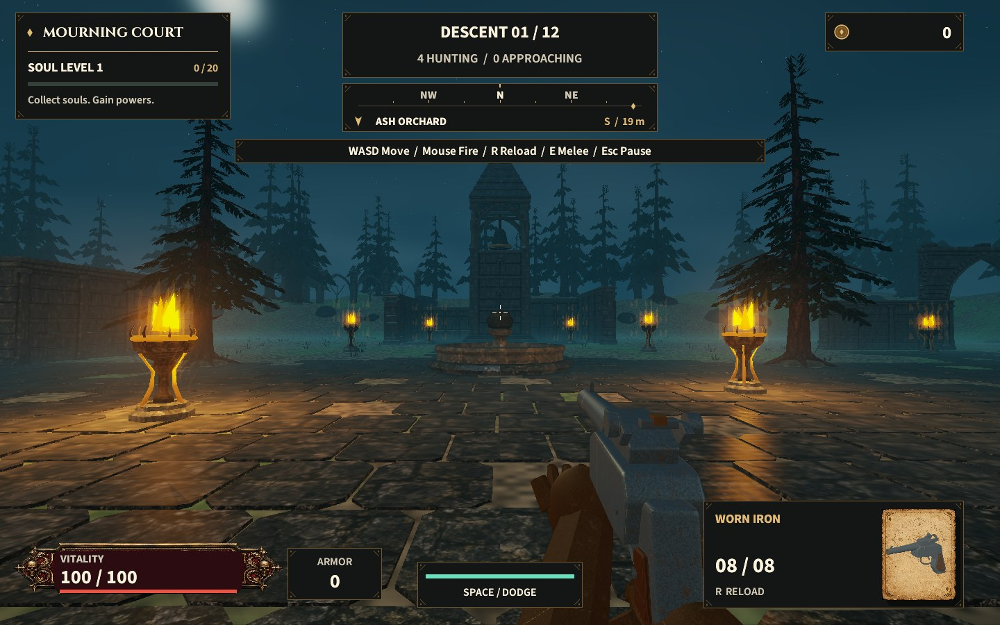
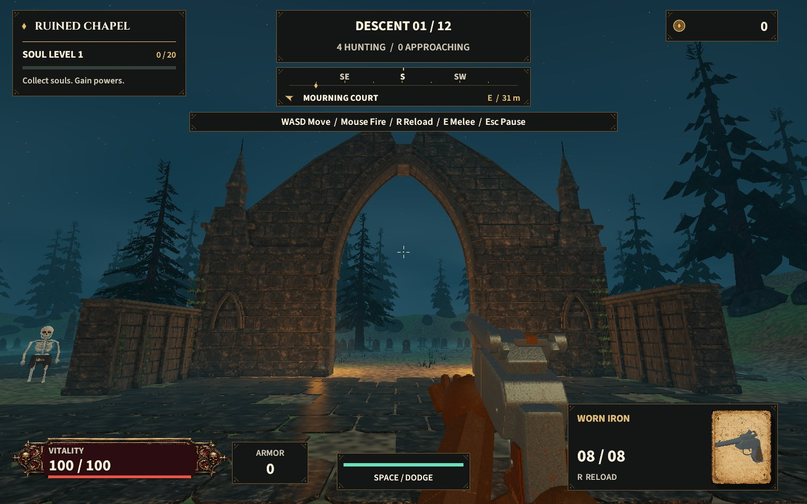
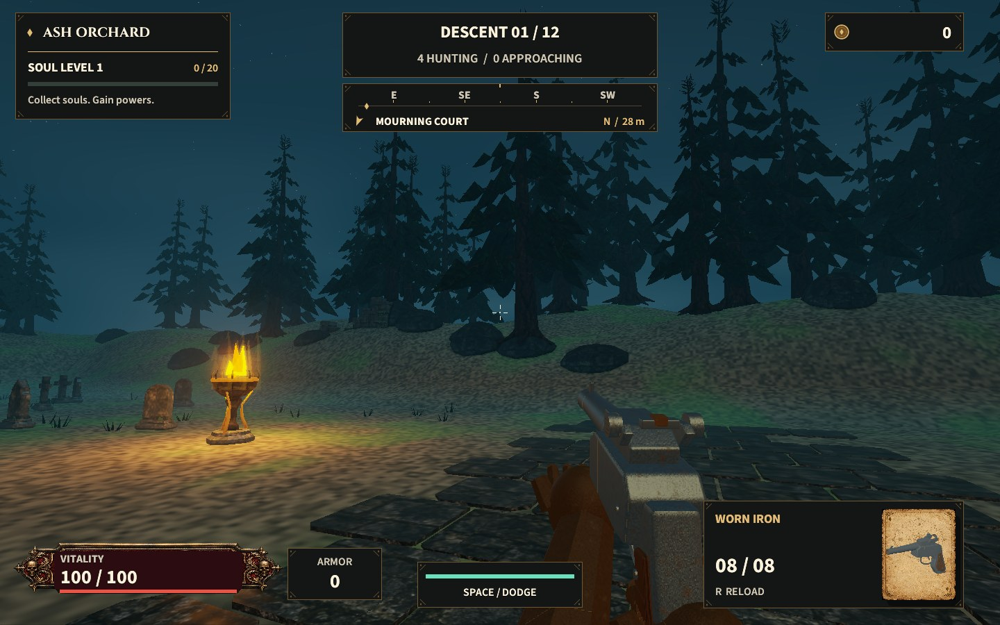

# Mournhollow expansion and environment review

The playable grounds are now 96 × 96 metres, compared with the former 35 × 35 metre movement boundary. This is approximately 7.5 times the nominal footprint, before subtracting architectural obstacles. The former continuous perimeter wall is gone. Broad paths link five districts, and wooded banks, boulders and distant ruins establish the outer boundary.

| District | Character and routes |
| --- | --- |
| Mourning Court | Open fighting space, a dry memorial fountain and sightlines toward the bell tower. |
| Ruined Chapel | A Gothic west-front portal, roofless masonry and four approaches, including a six-metre main doorway. |
| Sunken Cloister | An open western side, two five-metre arcades and a broad eastern escape route. |
| Bell Sanctuary | A 20-metre bell tower and an open southern approach, with routes around the tower and through the northern wall. |
| Ash Orchard | Grave clusters and obelisks flanking an open central path, with outer lanes connecting back around the grounds. |

The cloister's name is atmospheric; the playable floor stays level. Traversal does not introduce climbing or jumping. Small graves, grass and loose rubble are decorative; major masonry, trees, monuments and the fountain have collision.

## Original architecture and terrain

Ten original Blender assets add pointed portals, carved columns, ashlar courses, cornices, buttresses, a hanging bell, a slate spire, an octagonal basin, broken walls, fallen masonry, urns and obelisks. Together the source modules contain 70,344 triangles, reused throughout the world. The editable source is `assets/blender/mournhollow-landmarks.blend`; `scripts/build-landmarks.py` rebuilds the runtime exports. Placement contracts and counts are in `assets/architecture/manifest.json`.

Worn flagstones follow the courts and crossing paths. Continuous world-space soil shading adds earth, moss and gravel without repeating atlas strips. Smooth earthen banks, rocks and a taller forest give the grounds depth beyond the walking boundary. Eighteen braziers mark routes; the closest six provide local lighting. Transparent halos and contact shadows now render without writing depth, avoiding dark discs in reconstructed fog.

## How the larger arena plays

Player movement, enemy navigation, weapon cover and body physics share the major obstacle footprints. Swept movement prevents dashes crossing thin walls. A cached pursuit field routes enemies through doorways; nearby reinforcements follow the player's position in every district. Distant unseen stragglers can return to the fight without resetting damage or wave progress. Final soul drops cross the larger grounds promptly before the shop opens.

The HUD identifies the current district and adds a turning compass with a nearby landmark bearing. A **LAST THREAT** bearing appears when no reinforcements remain and at most three enemies are alive. Existing saves are retained; saved positions that overlap new architecture resolve to clear ground.

## Native verification

`--world-review` drives ordinary movement and sprint input through the actual game update loop between six stops. It checks that every frame stays outside solids, rejects teleport-sized steps, and separately probes contact with the chapel wall. The final fixtures simulate 48 enemies away from the old arena centre and show the last-threat indicator. Reviews do not load or write player saves or preferences.

```sh
cargo test --locked
cargo run --release --locked -- --world-review
cargo run --release --locked -- --world-review --world-offscreen --review-small
cargo run --release --locked -- --smoke
```

The final visible tour verified **184.9 metres** of continuous movement and all six arrival stops. Its 48-enemy live-AI scenario measured **61.5 FPS mean** at 1440 × 900, with an **18.88 ms p95** frame interval; surface acquisition averaged 14.28 ms. These measurements include desktop presentation and are not isolated GPU timings. The automated suite passes **61 tests**, including doorway navigation, shared cover, off-centre spawning, complete combat progression and geometry integrity. The native smoke run also passed combat → reward → pack tear/reveal/equip → upgrade → next round, including save serialization. The rebuilt app passed signature verification and was opened on its title screen.

Normal native captures and results are written to `captures/world/normal/`. The smaller offscreen review writes `captures/world/offscreen-small/`. Offscreen mode waits for GPU completion and measures serial simulation/rendering latency; its reciprocal rate is **not visible display FPS**. Screenshot and warm-up frames are excluded from timing.

The current scene contains 819,781 triangles, indexed into 100 conservative spatial visibility batches. Offscreen batches are skipped; enemy simulation continues. Indexed-geometry tests verify exact vertex attributes, and bounds tests include geometry crossing batch boundaries plus foliage motion margin.




